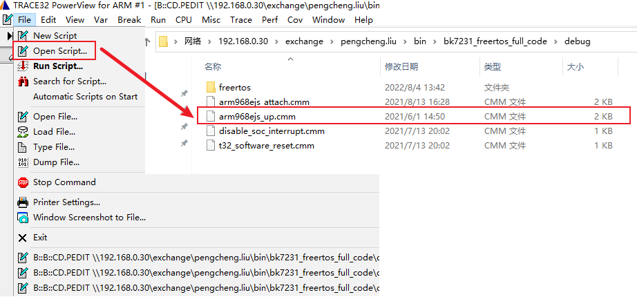
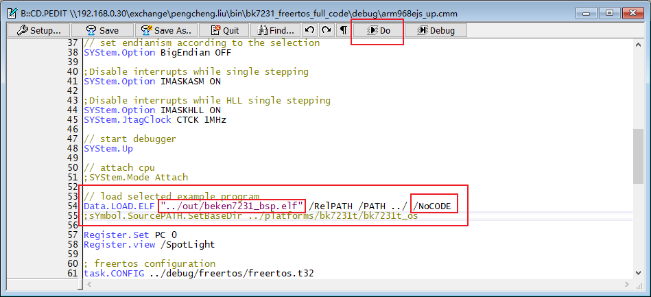
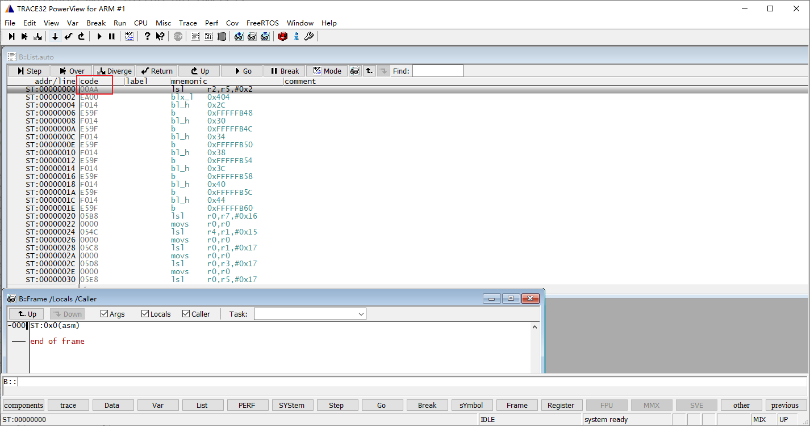
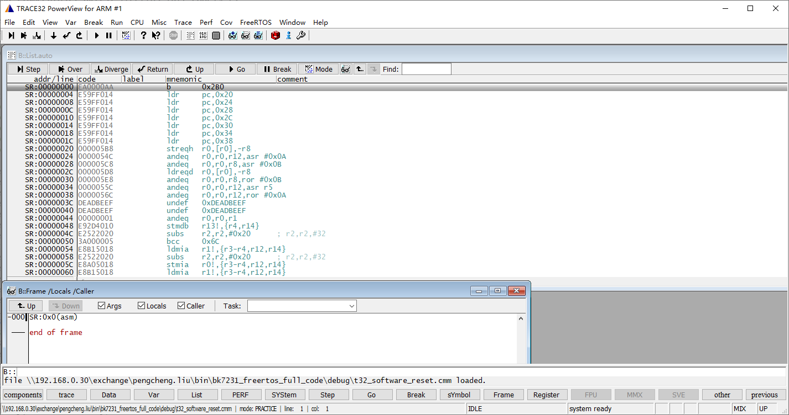
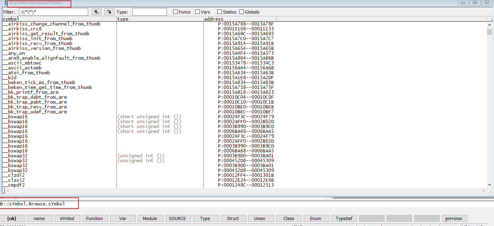

================
trace32的使用
================

基本使用
============

1. 打开脚本，一些常用脚本在当前的debug目录下

2. 打开脚本后，显示如下窗口，点击 ``Do`` 执行脚本，需要注意的脚本内容：

   - elf 路径配置，路径为跟脚本的相对路径，如图就是 ``arm9968ejs_up.cmm`` 上一级目录的out目录下
   - NoCODE
   - SYStem.CPU ARM968E

3. 执行 ``Do`` 显示如下窗口：

可以看到这边的机器码显示为2byte，显然是不正确的，这里我们执行下 ``t32_software_reset.cnm`` 这个脚本，可以看到显示正常了。
该窗口就是代码显示窗口，点击图中的 ``mode`` 可以切换显示模式。

调试窗口
============

-----------
符号表
-----------

如果想看符号表，两种方式：
 - View -> Symbols -> Browse Symbols
 - command line 输入： ``sYmbol.Browse.sYmbol``

