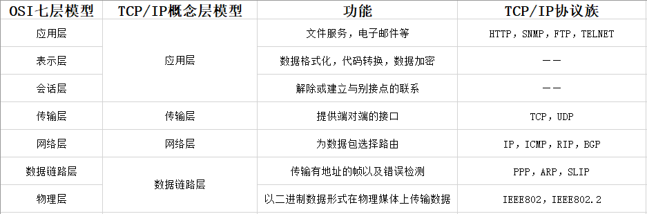

TCP/IP基本概念
====================================

计算机网络体系结构分层
---------------------------



上图展示了计算机结构的OSI七层模型以及TCP/IP概念模型。二者相对应的同时也有所不同, 前者注重“通信协议必要的功能是什么”, 后者强调“在计算机上实现协议应开发哪种程序”。

有关TCP/IP分层模型各层的具体描述见 `TCP/IP协议总结 <https://zhuanlan.zhihu.com/p/372904041>`_, 此处不再赘述。在此分层模型的基础上, 来看一下TCP/IP协议。

TCP/IP基础
-------------------

TCP/IP的含义
```````````````