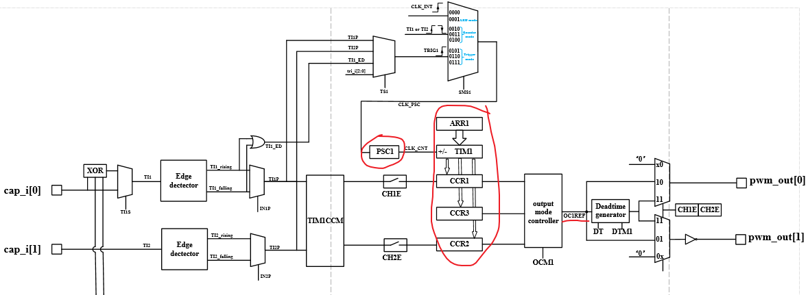
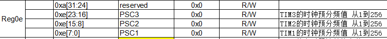

======
PWM
======

概述
======

bk7236 共有两组 PWM 控制器，PWM0 与 PWM1，每个PWM控制器下有3个TIM定时器，每个定时器有2个channel。

因此，每个 PWM 控制器有6个 channel，bk7236共支持12个 channel。

工作模式
===========

定时器可以工作在5种模式下：

 1. 输出比较模式(PWM mode)
 2. 输入捕获模式(Capture mode)
 3. 触发输入模式(trigger mode)
 4. 正交增量编码器模式(Encoder interface mode)
 5. LED驱动模式(LED driver mode)
 6. 霍尔传感器接口模式（Hall sensor interface mode）

功能框图
===========

----------
时钟源
----------

PWM 控制器 有两个时钟源可选：

 - clk_32K
 - XTAL

可通过 SYSTEM_REG0x8 配置。

-----------
PSC
-----------

预分频器，对输入时钟(clk_32K或XTAL)进行分频，输出CLK_CNT用来驱动计数器TIM计数。

PSC的设置可通过 ``REG_0xE`` 来配置，可实现1-256分频。

例如：

当我们时钟源选择XTAL=26M，配置PSC1=25时，计数器TIM时钟则为1MHz，若计时器+1，则为1us。

--------
CCR
--------

当计数器CNT的值跟比较寄存器CCR的值相等时，输出参考信号OCxREF的信号的极性就会改变，并且会产生CCxI中断，相应的标志位CCxIF（REG_0x8寄存器中）会置位。
然后OCxREF再经过一系列的控制之后输出PWM信号。

BK7236 每个TIM 对应3个 ``CCR`` ，即在一个周期内，信号的极性可以翻转3次，其中

 - CCR1,CCR2,CCE3(REG_0x15-REG_0x17)对应TIM1
 - CCR4,CCR5,CCE6(REG_0x18-REG_0x1a)对应TIM2
 - CCR7,CCR8,CCE9(REG_0x1b-REG_0x1d)对应TIM3

当用作PWM输出模式时，输出方波信号的占空比由CCR决定。

.. note::

  CCRx 需设置大于1的值。

----------
ARR
----------

自动重载寄存器ARR用来存放与计数器CNT比较的值，可以理解为计数器计数的 end_value。

PWM输出方波信号的频率由ARR值决定。

--------------------------
Deadtime generator
--------------------------

在生成的参考信号OCxREF的基础上，可以插入deadtime，用于生成两路互补的输出信号。

死区时间的大小具体由 ``REG_0x1E`` 的 DTx 配置。

PWM 输出模式
===============

---------------------
输出单路方波信号
---------------------

以 PWM0(GPIO6) 输出100Khz，占空比40%方波为例，其对应 cli 命令如下：

.. code:: text

    pwm 0 init 10 4
    pwm 0 start
    pwm 0 stop

详细步骤如下（假设 SYSTEM 寄存器内的PWM中断与时钟已正常配置）：

Step 1：配置分频系数

将Reg0e[7:0]配置为25，即实际分频值为26。所以输入到计数器TIM1的时钟频率为1MHz。

Step 2：配置TIM1的计数终点值

将 Reg0f TIM1_ARR 配置为9，即计数周期值为10，频率为100kHz。TIM1在计数到10个时钟脉冲后会产生一个更新事件。

Step 3：配置比较值CCR1（配置CCR1/2/3中的任意一个都可以）。

将 Reg15 CCR1 配置为4，即TIM1计数到4时产生一个比较成功事件。

Step 4: 配置比较输出模式OC1M。

将 Reg0a[23:21] OC1M 配置为3。即比较输出模式为遇到比较成功事件（CCR1）和更新事件（ARR1）都翻转。即每计数到4和10个时钟脉冲翻转。从而产生占空比为40%的方波。

Step5：使能pwm_o[0]通道。

将Reg0a[12]置1。打开通道chn1即pwm_o[0]。

Step 6：打开更新事件中断使能。

将Reg07[9]置1。当TIM1计数到ARR1时产生中断，相应的标志位UIF1置1。中断处理完毕后需要软件写1清零该标志位。

Step 7：打开计数器使能CEN1。

将 Reg04[2] CEN1 置1。

---------------------
输出互补带死区PWM
---------------------

示例2：

pwm_o[1:0]输出互补的PWM方波，频率为20KHz,占空比为50%，死区时间为2us，并在pwm_o[0]下降沿（比较成功点）产生中断。

详细步骤如下：

Step 1：配置分频系数。

将 Reg0e[7:0] PSC1 配置为25，即实际分频值为26。所以输入到计数器TIM1的时钟频率为1MHz。

Step 2：配置TIM1的计数终点值。

将 Reg0f TIM1_ARR 配置为49，即计数周期值为50，频率为20kHz。TIM1在计数到50个时钟脉冲后会产生一个更新事件。

Step 3：配置比较值CCR2（配置CCR1/2/3中的任意一个都可以）。

将 Reg16 CCR2 配置为25，即TIM1计数到25时产生一个比较成功事件。

Step 4：配置比较输出模式OC1M。

将 Reg0a[23:21] OCM1 配置为3。即比较输出模式为遇到比较成功事件（CCR2）和更新事件（ARR1）都翻转。即每计数到25和50个时钟脉冲翻转。从而产生占空比为50%的方波。

Step 5：使能pwm_o[1:0]通道。

将Reg0a[13]，Reg0a[12]置1。打开通道chn1/chn2即pwm_o[1:0]。

Step 6：设置极性ch1p/ch2p。

pwm[1:0]的来源都是计数器与CCR2比较后产生的参考方波ocref。极性ch1p/ch2p的默认值都是00正极性，即与ocref相位相同。现需要得到互补波形，所以将pwm_o[1]即ch2p设置为反极性。将Reg0a[3:2]配置为1。

Step 7：设置死区时间。

将死区时间配置为2个时钟周期即2us。将 Reg1e[9:0] DT1 配置为2。

Step 8：打开比较事件中断使能。

将 Reg07[1] CC2IE 置1。当 TIM1 计数到 CCR2 时产生中断，相应的标志位 CC2IF 位置1。中断处理完毕后需要软件写1清零该标志位。

Step 9：打开计数器使能CEN1。

将 Reg04[2] CEN1 置1。

hw_ch 0-5
sw-ch 0-11
id    0,1