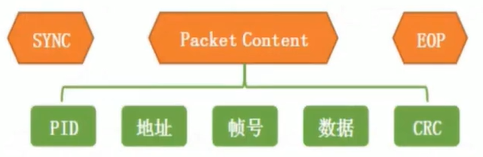

============
cherry_usb
============

设备协议栈切入点

USB 中断。

总结 USB IP 中断类型的共同点：

 - 状态类中断

   - 复位
   - 挂起
   - 恢复
   - VBUS

 - 端点类中断

   - 端点0中断
   - 其他端点中断

 - 其他中断

   - SOF 中断
   - 错误中断

端点
========

Endpoint 是 host 与 device 之间通讯数据的接收或来源，主机与设备之间的通信最终归结到端点上，它是主机与设备间通信流的一个逻辑终端。

管道：则是主机与设备之间通信需要使用的数据缓存区，每个端点对应一个管道，并且独立工作，互不影响。类似于uart里面的fifo，我们将数据写到fifo里，它帮我们发出去。

设备地址：主机为了区分不同的设备，进行了地址的的分配，一个设备只有一个设备地址，但是可以有多个端点地址。

端点三个收发方向：

 - 双向
 - 单向IN(device->host)
 - 单向OUT(host->device)

端点有哪些属性：

 - 端点地址
 - 端点方向
 - 端点传输类型 (control/interrupt/isochronous/bulk)
 - 端点传输最大包长
 - 端点传输间隔
 - 高带宽端点的配置

--------
端点中断
--------

端点中断分类：

 - 端点0中断
 - 非端点0中断

端点0中断
-------------

端点0 默认是一个双向端点，并且使用control传输，又称为控制端点。既然是双向，那么传输方向就可以分为in 和 out 方向。
而 out 方向由于控制传输的特殊性，又分为命令的 out 和数据的 out。

为什么要用控制传输？

一方面主机需要知道设备是什么，具备什么属性，另一方面，主机也要对设备进行一些配置，从而引入了控制传输。

那么根据不同的方向，将会触发不同的中断，端点0则有三个中断：

 - out 命令中断(setup中断)
 - out 数据中断
 - in 中断

非端点0中断
-------------

非端点0，基本用来枚举完成以后进行数据的传输，并且传输类型可以设置为 批量、中断、同步传输。方向可以为单向和双向，
也就是会用到in和out方向，那么使用到的中断则是：

 - out 中断
 - in 中断

事务
=========

刚刚提到的几个中断类型，其实就是事务的中断。端点0就是

 - setup事务
 - out事务
 - in事务

非端点0则是

 - out事务
 - in事务

当我们想要把数据发送给主机的时候，并不是直接发送数据，而是在数据的前后进行组包，组成多个包以后，进行数据的传输，最终多个包的组成，就构成了事务，
所以事务由多个包组成。

包分为Token、Data、Handshake、Special。包又继续细分，由多个字段组成。
包的组成是由 USB IP(USB PHY) 做，所以我们不需要关心包怎么组成的。

-----------
setup事务
-----------

setup事务主要用于发送命令，命令的格式是usb spec定义的，称为setup包格式，一共8字节。

.. code-block:: text

    80 06 00 01 00 00 40 00

设备在收到setup事务中断以后，表示收到8字节了，需要读取这8个字节并进行处理，处理完成以后回复主机。

.. figure:: ../_static/format_of_setup_data.png
    :align: center
    :alt: Images
    :figclass: align-center

-------
IN 事务
-------

设备向主机发送数据，发送完成以后，会进入IN事务中断，所以这个IN事务中断就等价于dma finish中断/uart tx 中断。
由于每次发送长度有限制，in事务中断一般用于发送剩余数据，没有数据的话就什么都不做就行了。

---------
OUT 事务
---------

主机向设备发送数据，数据成功接收以后就会进入out事务中断，等价于uart rx 中断（但不是单字节的中断，而是多字节的）

描述符
========

 - 设备描述符
 - 配置描述符
 - 接口描述符
 - IAD描述符
 - 端点描述符
 - 字符串描述符
 - 设备限定描述符(Device_Qualifier Descriptor)
 - class 自定义描述符

-----------------
接口描述符
-----------------

接口描述符

 - 描述设备的一个功能，并且一个接口基本对应一个class类
 - 一般来说设备驱动说的就是接口驱动 (class 驱动)
 - 由多个端点组成，用于数据收发

-----------------
端点描述符
-----------------

bEndpointAddress

0x81 对应 IN 中断
0x03 对应 OUT 中断

设备协议栈中注册框架实现
==========================

三个结构体：

 - class 结构体，用于挂载接口，对应多个接口的话就挂载多个接口
 - class 需要的接口结构体
 - 接口需要的端点结构体

----------------
复合设备示例
----------------

假设有复合设备 cdc + msc + hid，已知：cdc 2个interface，msc 1个interface，hid 1个Interface

.. code-block:: c

    void usbd_desc_register(const uint8_t *desc);

    void usbd_add_interface(struct usbd_interface *intf);
    void usbd_add_endpoint(struct usbd_endpoint *ep);

    int usbd_initialize(void);

常用场景 API 使用
==========================

-------------------
device 接收数据
-------------------

.. code-block:: c

    int usbd_ep_start_read(const uint8_t ep, uint8_t *data, uint32_t data_len);

.. note::

    该接收函数只能在中断中使用

-------------------
device 发送数据
-------------------

.. code-block:: c

    int usbd_ep_start_write(const uint8_t ep, const uint8_t *data, uint32_t data_len);

.. note::

    该接收函数如果不在中断中使用，就是阻塞形式的传输，如果在中断中使用，就是异步传输

当我们调用完usbd_ep_start_write，如果成功发送，将会进入到之前注册是ep_in中断。

USB 枚举过程
==============

USB 枚举过程：

 - 设备插入，并供电
 - 主机对设备进行复位
 - 主机发送获取设备描述符命令
 - 复位（可选）
 - 主机发送设置地址命令
 - 主机发送获取设备描述符命令
 - 主机发送获取配置描述符命令
 - 主机发送获取字符串描述符命令
 - 主机发送设置配置命令，设备需要配置一些端点信息。此时表示枚举完成
 - 主机根据描述符加载驱动并执行相关class请求
 - 正常数据传输