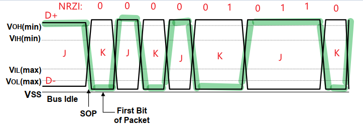
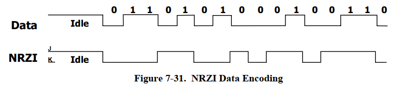
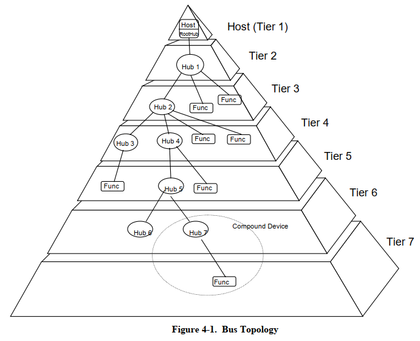
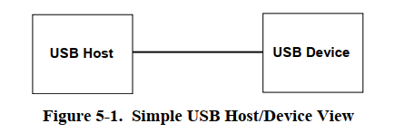
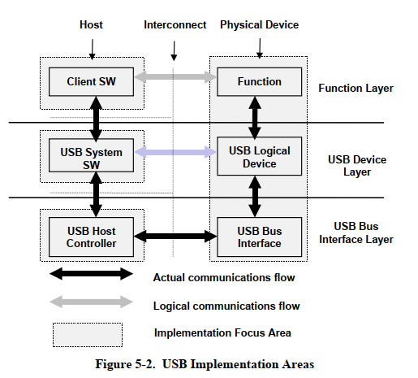
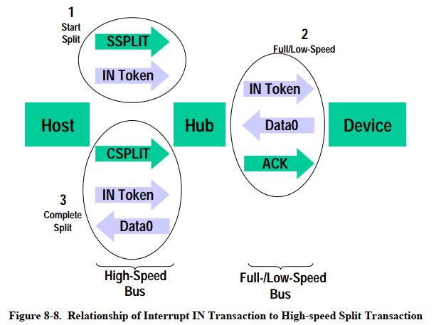
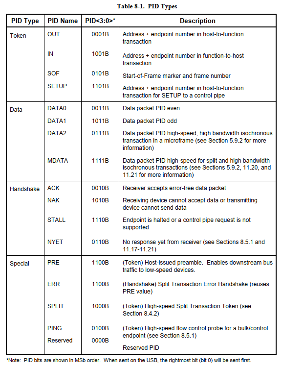
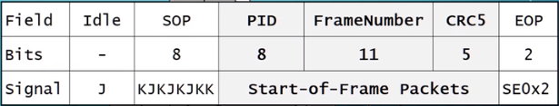
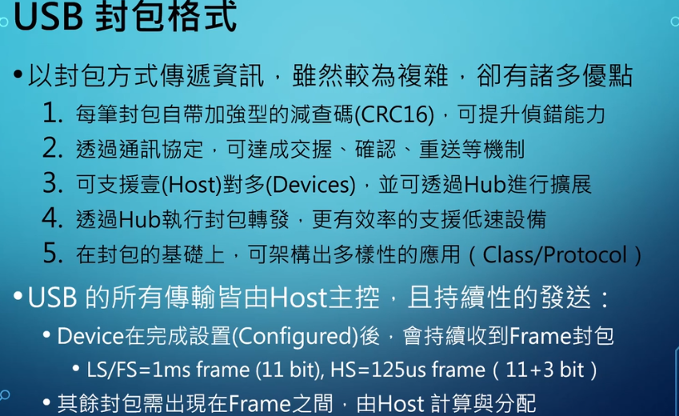

=========
summary
=========

参考资料
============

参考资料：

 - `USB官方文档 <https://www.usb.org/documents>`_
 - `CherryUSB文档 <https://cherryusb.readthedocs.io/zh_CN/latest/>`_
 - `usb-20-specification <https://www.usb.org/document-library/usb-20-specification>`_
 - <<圈圈教你玩USB>>
 - 简书 jianshu_kevin@126.com 的文章

     - `USB协议 (一) <https://www.jianshu.com/p/3afc1eb5bd32>`_
     - `USB协议 (二) <https://www.jianshu.com/p/cf8e7df5ff09>`_
     - `USB协议 (三) <https://www.jianshu.com/p/2a6e22194cd3>`_

https://hellocode.blog.csdn.net/article/details/112123884

USB 基本说明
=============

USB 硬件信号
============

.. figure:: ../_static/usb_connector.png
    :align: center
    :alt: Images
    :figclass: align-center

----------------
J state K state
----------------

对于USB来说，以D+,D-来说，它在工作状况下，看到的波形如下图所示：绿色代表D+

.. figure:: ../_static/packet_vol_levels.png
    :align: center
    :alt: Images
    :figclass: align-center

在这样的波形下，怎么来定义哪一个是1，哪一个是0？

在USB的定义里面，它是采这样的波形方式，它的做法就是这样：
 - D+ > D-时，定义这个信号为 ``J信号``
 - 否则，D+ < D-，定义这个信号为 ``K信号``

所以，在USB的信号定义里面，它是用J跟K的state，而不是普通的0和1(0 低电平，1 高电平)

在USB的传输里面，它是6+1的Bit stuffing(J超过6个或者K超过6个就补一次反转)

----------
NRZI 编码
----------

USB 里面定义了J状态 K状态，可是到底哪一个是0，哪一个是1？

USB 用 ``NRZI`` 的编码来定义，什么是0，什么是1？

In NRZI encoding, a “1” is represented by no change in level and a “0” is represented by a change in level.

 - 前面是J状态，当前状态是K状态(J->K)，或者K->J，那么就是对应逻辑0
 - 当前信号与前面信号是一样的（当前是J前面也是J，或者当前是K前面也是K），表示逻辑1

所以看USB的波形很简单： **只要是交替的，交替的位置就是0；如果宽度超过1bit宽度，下一个就是1**

--------
总结
--------

总结下USB的硬件信号：
 - USB 使用差分信号进行传输

   - USB 2.0 Standard：D+/D-，所以是半双工   白色或者黑色的头
   - USB 3.1: D+/D-, (Tx+/Tx-,Rx+/Rx-) 蓝色的头
   - Type-C: D+/D-, Tx1+/Tx1-, Rx1+/Rx1-, Tx2+/Tx2-,Rx2+/Rx2-
 - USB 2.0 Full Speed(12M)，High Speed(480M)使用 ``NRZI`` 编码

   - 当 D- < D+，定义为 ``J state``
   - 当 D+ < D-，定义为 ``K state``
   - NRZI定义：当讯号改变时，为逻辑0，反之为逻辑1
   - 出现连续6个逻辑1，必须插入反转(bit-stuffing)

Q：如果出现连续6个逻辑1，那么这个时候的准位，是在J还是K呢？

A：有可能是J，也可能是K，因为逻辑1的定义是 J->J 或者 K->K

USB 封包格式
============

-------------
USB Topology
-------------

带着这样的疑问来看下面的内容：USB 为什么要采用封包的形式来传递数据？

从上图可以看到：

 - 金字塔的顶端，它是一个USB Host Hub，一般称为 Root Hub，有且只能有一个， single root
 - 可以看到这个金字塔有7层，中间有5层可以接Hub。所以 USB 的规范里面，它的Hub最多是5层(为什么最多只能是5层？)
 - 从Tier2到Tier7，会发现USB的定义里面，它只有两种装置：

   - Hub，就是图上白色的部分
   - Function，也就是Device（键盘，U盘）
   - 不过，它的Hub是一种很特别的设定，它的Hub是透明的， Transparent Hub。在USB的通讯里面，通常都是由Host(or Root Hub)跟Function直接做沟通。
     总之，这个是USB的设定，中间的Hub是定位为 **透明桥接**，真正的沟通作业，就是由HOST跟Function直接来进行，不管中间过了几个Hub
 - Compound 装置，就是最下面画圈圈的地方。它实际上是一个Hub，但这个Hub内建一个Device。可以想象成这两个为一整体，共同组成一个Device

如果你再看这个金字塔结构就会发现，USB这样子的设定，它就必须采用封包的格式，因为各位可以看到，它的Device有可能直接插到Root Hub，也有可能过了好几个Hub，才
插到最底下，所以在这样子的架构底下，如果你不用封包格式来传递，那真的很难做到。但如果你用封包的方式来做，则你发送的信息，因为是一个一个的封包，所以Hub可以帮你
传递、再传递，有点像你寄信。

---------------------
USB Compound Device
---------------------

------------------
Host vs Device
------------------

在USB protocol的设计里面，它的封包在传递的时候，它会分层：
 - Function layer
 - USB device layer
 - USB Bus Interface layer

USB device layer
------------------

USB device layer 这一层会做很多USB基本的部分，就是当你插上去之后，
 - 它要先给你一个地址， ===>分配地址
 - 给了地址之后，要做一些Configuration    ===>选择配置

这一层做的事情，它不分任何的装置，这层做的事情，几乎都是类似的，一般这一层是操作系统帮你做的

Function layer
----------------

这一层跟实际插进去的装置是相关的，比如说HID(鼠标)，那么就需要Mouse Driver

------------------
高低速封包的转发
------------------

------------------
USB 封包类型
------------------

USB 的封包，它的格式只用4 bit来做区分。USB的封包分为4大类，最常用的是前三种。

一个标准的Transection，它是会follow:
 - 先发 token
 - 再发 data
 - 再做 Handshake

在某些状况下，发完Token之后，就可以直接收Handshake;
也有一些状况是，只发Token、Data，不需要Handshake

在这个封包里面，大部分都是先发Token，发完Token，后面才接Data，或Handshake。

有一个封包是最特别，也是最短的，就是单单只有Token，这个封包叫 **SOF** ，start of frame

--------------------------
SOF(Start-of-Frame) 封包
--------------------------

SOF token，是当你的设备接上Host，配到地址、设置完毕之后，Host就会不断地发 ``SOF`` 给Device
 - Full speed 设备：每 **1ms** 就会收到一个SOF Packet，例如鼠标
 - High speed 设备：每 **125us** 就会收到一个SOF Packet，例如camera

SOF 格式如下图所示：
 - Idle状态：Bus 上呈现一个持续非常久的 J state，这个一定超过了bit stuffing的规范，这个状况会被判定是Idle
 - 当封包要出现的时候，会先出现 ``SOP``，对应 ``KJKJKJKK``，一共8bit
 - 接下来是真正的packet，封包总共24 bit，就是SOF

   - PID 就是上面看到的封包类型 0101B（这边为什么是8 bit呢？ 因为PID会自带检查码，它会把 0101B 的反向值当成检查码）
   - 11 bit Frame number
   - CRC 5 bit
 - 2 bit 结束

以上就是一个完整的封包，而这个封包是每隔 Full speed 1ms/High speed 125us 就会收到一次

------
总结
------

USB 波形示例
==============

