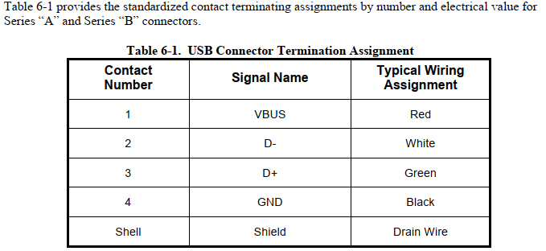
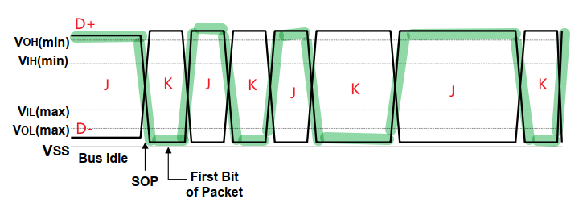

=========
summary
=========

参考资料
============

参考资料：

 - `USB官方文档 <https://www.usb.org/documents>`_
 - `CherryUSB文档 <https://cherryusb.readthedocs.io/zh_CN/latest/>`_
 - `usb-20-specification <https://www.usb.org/document-library/usb-20-specification>`_
 - <<圈圈教你玩USB>>
 - 简书 jianshu_kevin@126.com 的文章

     - `USB协议 (一) <https://www.jianshu.com/p/3afc1eb5bd32>`_
     - `USB协议 (二) <https://www.jianshu.com/p/cf8e7df5ff09>`_
     - `USB协议 (三) <https://www.jianshu.com/p/2a6e22194cd3>`_

USB 基本说明
=============

USB 硬件信号
============

----------------
J state K state
----------------

对于USB来说，以D+,D-来说，它在工作状况下，看到的波形如下图所示：绿色代表D+

在这样的波形下，怎么来定义哪一个是1，哪一个是0？

在USB的定义里面，它是采这样的波形方式，它的做法就是这样：
 - D+ > D-时，定义这个信号为J信号
 - 否则，D+ < D-，定义这个信号为K信号

所以，在USB的信号定义里面，它是用J跟K的state，而不是普通的0和1(0 低电平，1 高电平)

在USB的传输里面，它是6+1的Bit stuffing