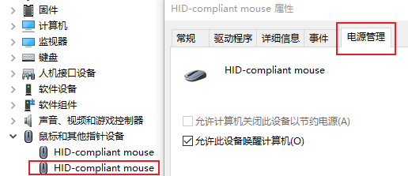
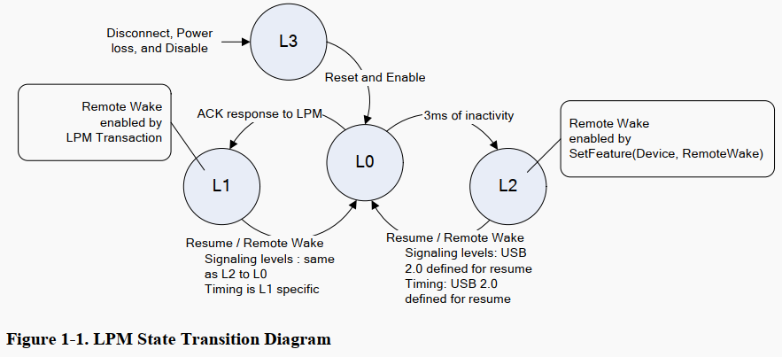
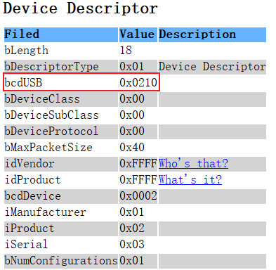
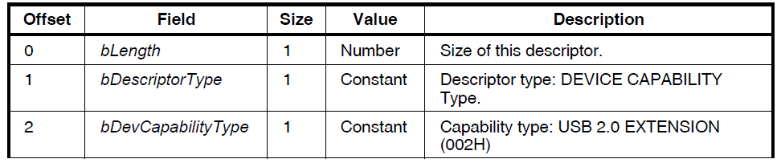
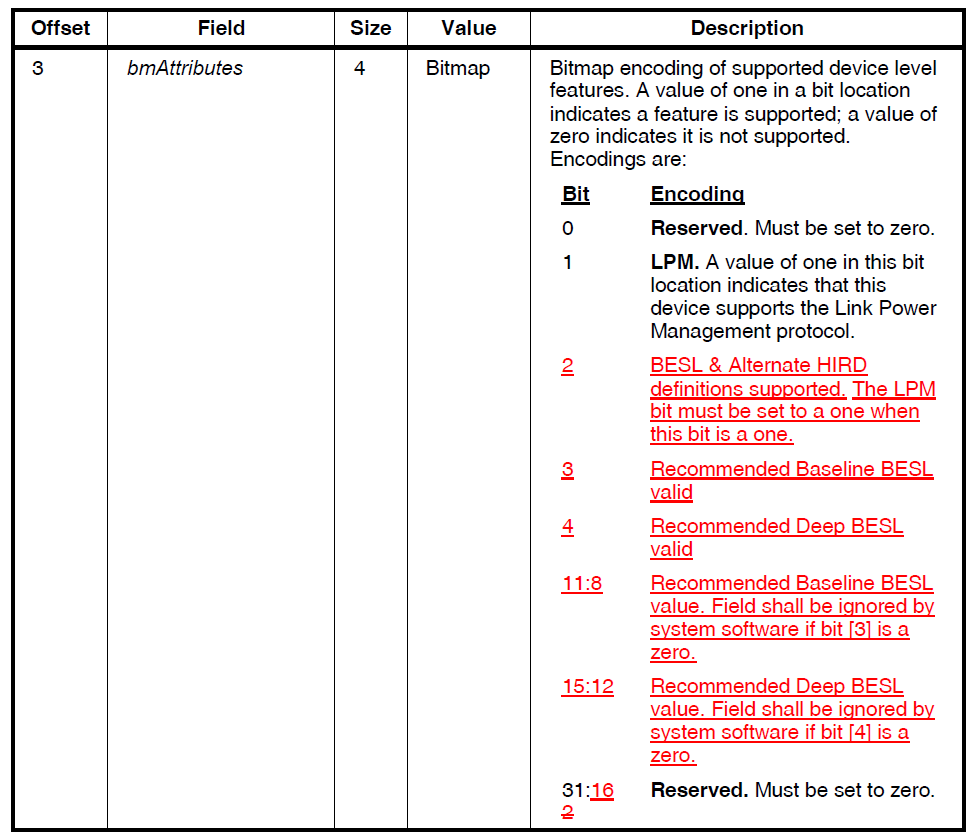
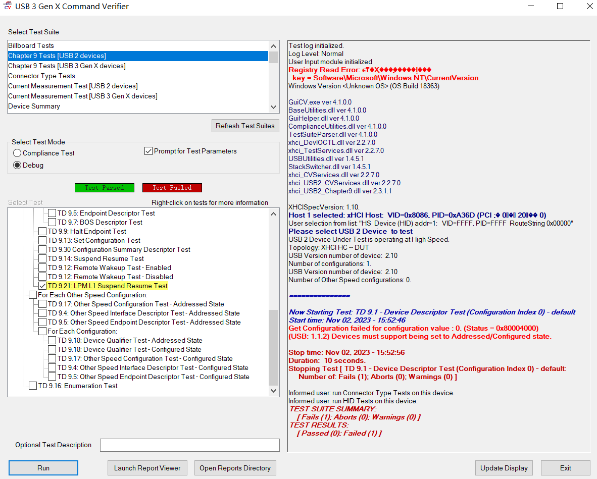
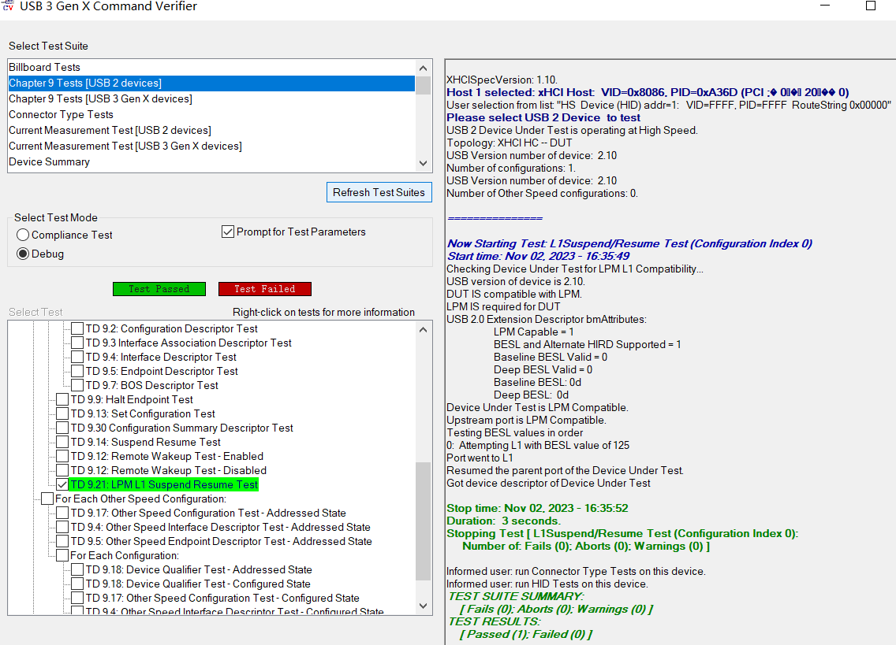
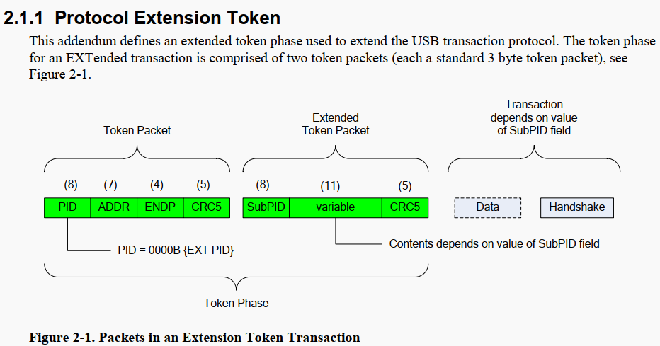

===========================
LPM L1 suspend and resume
===========================

参考文档
===============

**musbmhdrc_pspg.pdf**    Mentor USB IP 文档，重点看 P100 介绍 suspend resume 相关内容

**USB2_LinkPowerMangement_ECN[final].pdf**

**USB2-LPM-Errata-final.pdf**

LPM 概述 (Link Power Management)
======================================

首先选用 hid_mouse 作为 usb device 调试 LPM，为什么选 hid device ？因为 hid 设备 windows 可以有电源管理可供配置，uvc 设备就没有。

With the introduction of Link Power Management, there are two basic methods for the MUSBMHDRC to be suspended and
resumed. These two methods are demonstrated in the basic LPM transaction diagram shown below.

usb device 支持 LPM feature
=====================================

作为 device 来说，你得在枚举的过程中告诉 host，你支持 LPM，它才会让你进到L1 state，所以代码在写 device 描述符时，得有相关配置。

1. USB 2.0 Device Descriptor 中的 bcdUSB 字段需为 ``0210H`` 或者更高版本。

2. BOS 描述符

+----------+-----------------+------+-----------------------------------------+
| 字节偏移 | 字段            | 长度 | 描述                                    |
+==========+=================+======+=========================================+
| 0        | bLength         | 1    | 描述符的大小，固长为5                   |
+----------+-----------------+------+-----------------------------------------+
| 1        | bDescriptorType | 1    | BOS描述符类型，固定为15                 |
+----------+-----------------+------+-----------------------------------------+
| 2        | wTotalLength    | 2    | BOS描述符的总大小，以字节为单位         |
+----------+-----------------+------+-----------------------------------------+
| 4        | bNumDeviceCaps  | 1    | BOS描述符中独立设备功能特性描述符的数量 |
+----------+-----------------+------+-----------------------------------------+

在本例中，BOS描述符配置如下

.. code-block:: text

    0x05，//设字节数大小，为0x5
    0x0f, //描述符类型，固定为15
    0x0c, 0x00, //总大小, 12
    0x01, //设备功能特性描述符的数量

1. USB 2.0 Extension 描述符

在本例中，USB 2.0 Extension 描述符配置如下，重点关注 bmAttributes 字段。

.. code-block::

    0x07,  //设备描述符的字节数大小
    0x10,  //描述符类型编号，为DEVICE CAPABILITY，固定为16
    0x02,  //特性类型：USB 2.0 EXTENSION，固定02H
    0x06,0x00,0x00,0x00  // BIT[1] LPM，BIT[2] BESL & Alternate HIRD definitions supported

Mentor 支持 L1 state
==========================

这部分内容具体参考 ``musbmhdrc_pspg.pdf`` P100 左右的内容。

具体代码如下：

.. code-block:: c

    HWREGB(USB_BASE + MUSB_LPM_CNTRL_OFFSET) = (USB_LPMCNTRL_EN_M | USB_LPMCNTRL_TXLPM | USB_LPMCNTRL_NAK);
    HWREGB(USB_BASE + MUSB_LPM_INTREN_OFFSET) = (USB_LPMIM_ACK | USB_LPMIM_RES);

LPM L1 suspend and resume 测试
================================

首先，无论进入 L1 state 还是 L2 state，都是由Host主动发起的，

但是点击电脑的睡眠只会进入suspend mode（L2 state），而不会进入L1 state。

那么，如何让 usb device 进入 L1 state？

这里用到 USB 官方工具，下载地址如下：

https://usb.org/document-library/usb3cv

测试成功界面会显示Pass，并且device 端会收到 LPMACK 和 LPMRES 中断。

.. warning::
    使用 USB3CV 这个软件做测试时，会导致鼠标和键盘无法使用，所以最好用笔记本测试，用触控板控制电脑，且 USB 上只接将要测试的设备。

L1 state 流程
=================

详细见 ``musbmhdrc_pspg.pdf`` P100 内容

LPM token
============

The extension transaction uses the remaining USB 2.0 reserved PID value (0000B), which is in the Special PID
type group. This addendum names this PID value the EXT PID, as illustrated in Table 2-1. Note, this table
overrides Table 8-1 PID Types in the USB specification, Revision 2.0.

