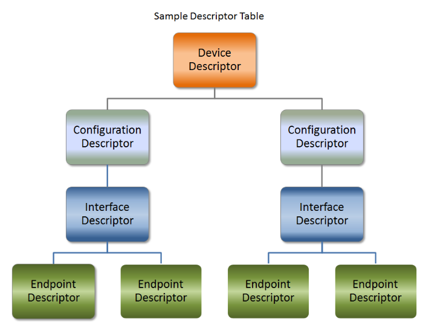
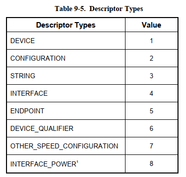
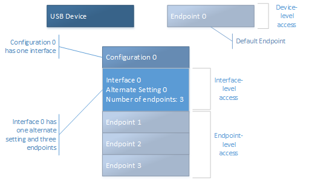
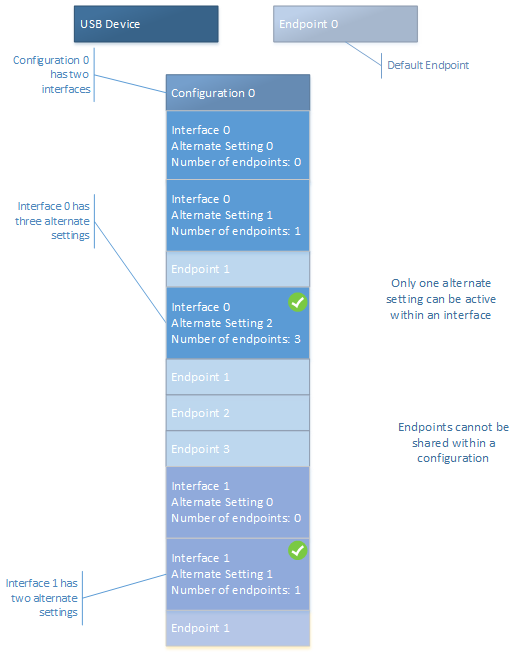
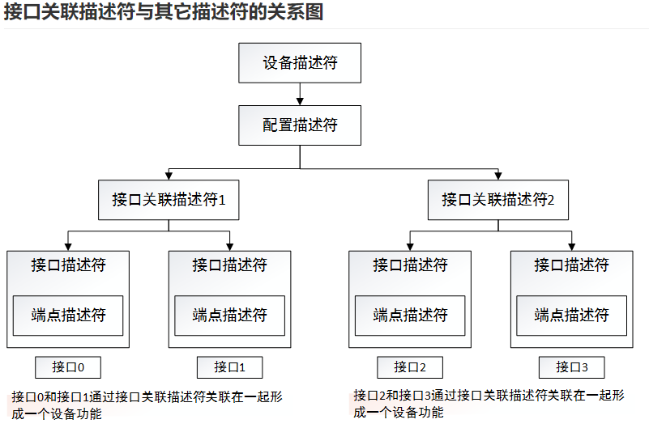

=================
usb_descriptor
=================

USB 描述符类型及功能
======================

USB描述符都有那些功能呢？
 - 每一个USB设备只有一个 **设备描述符** ，主要向主机说明设备类型、端点0最大包长、设备版本、配置数量等等。
 - 每一个USB设备至少有一个或者多个 **配置描述符** ，但是主机同一时间只能选择某一种配置，标准配置描述符主要向主机描述当前配置下的设备属性、所需电流、支持的接口数、配置描述符集合长度等等。
 - 每一个USB配置下至少有一个或者多个 **接口描述符** ，接口描述符主要说明设备类型、此接口下使用的端点数（不包括0号号端点），一个接口就是实现一种功能，实现这种功能可能需要端点0就够了，可能还需要其它的端点配合。
 - 每一个USB接口下至少有0个或者多个 **端点描述符** ，端点描述符用来描述符端点的各种属性。
 - **字符串描述符** 就是用字符串描述一个设备的一些属性，描述的属性包括设备厂商名字、产品名字、产品序列号、各个配置名字、各个接口名字。

USB 描述符类型编号
==================

USB 设备描述符布局
==================

--------------------
简单的USB设备功能
--------------------

一般一个接口代表着该设备的一个独立功能。

--------------------
复杂USB设备功能
--------------------

复杂设备功能是由多接口通过接口关联描述符组合完成USB设备的功能。

在上述设备中，配置0具有两个接口： Interface 0 和 Interface 1。 接口0具有三个替代设置（alternate setting 接口）。 在任何给定时间，只有一个备用
设置处于活动状态。 请注意，替代设置0不使用终结点，而备用设置1和2使用终结点1。 通常，视频摄像机使用 同步端点 进行流式处理。 对于这种类型的端点，在
使用端点时，会在总线上保留带宽。 当照相机未流式传输视频时，客户端驱动程序可以选择备用设置0来节省带宽。 当网络摄像机是流式传输视频时，客户端驱动程
序可以切换为备用设置1或备用设置2，这将提供更高的质量级别并消耗增加的总线带宽。 接口1具有两个替代设置。 类似于接口0，备用设置0不使用终结点。 替换
设置1定义为使用终结点1。

端点不能在配置中的两个接口之间共享。 设备使用端点地址来确定数据传输或端点操作的目标端点，如管道重置。 所有这些操作都由主机启动。

USB 通用描述符的通用结构
=========================

+-------+-----------------+-------+-----------------------------------+----------------------------+
|Offset |Field            |Size   |Value                              |Description                 |
+=======+=================+=======+===================================+============================+
|0      |bLength          |1      |Number                             |Size of Descriptor in Bytes |
+-------+-----------------+-------+-----------------------------------+----------------------------+
|1      |bDescriptionType |1      |Constant                           |DescriptorType              |
+-------+-----------------+-------+-----------------------------------+----------------------------+
|2      |…                |n      |Start of parameters for descriptor |                            |
+-------+-----------------+-------+-----------------------------------+----------------------------+

.. code-block:: c
    :linenos:

    typedef struct {
        uint8_t bLength;
        uint8_t bDescriptionType;
    } MUSB_DescriptorHeader;

USB 设备描述符
===============

设备描述符是USB设备的第一个描述符，每个USB设备都得具有设备描述符，且只能拥有一个。

.. code-block:: c
    :linenos:

    typedef struct
    {
        uint8_t bLength;            //设备描述符的字节数大小，为0x12
        uint8_t bDescriptorType;    //描述符类型编号，为0x01
        uint16_t bcdUSB;
        uint8_t bDeviceClass;
        uint8_t bDeviceSubClass;
        uint8_t bDeviceProtocol;
        uint8_t bMaxPacketSize0;
        uint16_t idVendor;
        uint16_t idProduct;
        uint16_t bcdDevice;
        uint8_t iManufacturer;
        uint8_t iProduct;
        uint8_t iSerialNumber;
        uint8_t bNumConfigurations;
    } __attribute__ ((packed))  MUSB_DeviceDescriptor;

USB 配置描述符
=================

配置描述符定义了设备的配置信息，一个设备可以有多个配置描述符。

配置描述符指定设备的供电方式、最大功耗是多少、它拥有的接口数量。因此，可以有两种配置，
一种用于设备由总线供电时，另一种用于设备供电时。由于这是接口描述符的“头”，因此使一种配置使用与另一种配置不同的传输模式也是可行的。

.. code-block:: c
    :linenos:

    typedef struct
    {
        uint8_t bLength;                //配置描述符的字节数大小，固定为9字节
        uint8_t bDescriptorType;        //描述符类型编号，为0x02
        uint16_t wTotalLength;          //配置所返回的所有数量的大小
        uint8_t bNumInterfaces;         //此配置所支持的接口数量
        uint8_t bConfigurationValue;
        uint8_t iConfiguration;
        uint8_t bmAttributes;
        uint8_t bMaxPower;
    } __attribute__ ((packed)) MUSB_ConfigurationDescriptor;

USB 接口描述符
=================

.. code-block:: c
    :linenos:

    typedef struct
    {
        uint8_t bLength;            //设备描述符的字节数大小，为0x09
        uint8_t bDescriptorType;    //描述符类型编号，为0x04
        uint8_t bInterfaceNumber;
        uint8_t bAlternateSetting;
        uint8_t bNumEndpoints;
        uint8_t bInterfaceClass;
        uint8_t bInterfaceSubClass;
        uint8_t bInterfaceProtocol;
        uint8_t iInterface;
    } __attribute__ ((packed))  MUSB_InterfaceDescriptor;

USB 接口关联描述符
==========================

对于复合USB设备的接口描述符，可以在每个类（Class）要合并的接口描述符之前加一个接口关联描述符(Interface Association Descriptor，IAD),
其作用就是把多个接口定义成一个类设备，即多个接口作用于一个设备。

.. code-block:: c
    :linenos:

    typedef struct {
        uint8_t bLength;            //长度为8
        uint8_t bDescriptorType;    //USB_INTERFACE_ASSOCIATION_DESCRIPTOR_TYPE，值为0x0b
        uint8_t bFirstInterface;    //第一个接口编号
        uint8_t bInterfaceCount;    //接口总数量
        uint8_t bFunctionClass;     //视频接口类代码CC_VIDEO，值0x0E
        uint8_t bFunctionSubClass;  //视频子类接口代码 SC_VIDEO_INTERFACE_COLLECTION,值为0x03
        uint8_t bFunctionProtocol;  //未用，必须为PC_PROTOCOL_UNDEFINED，值为0x00
        uint8_t iFunction;          //字符串描述符索引
    } __attribute__ ((packed))  MUSB_InterfaceAssociationDescriptor;

USB 端点描述符
=================

.. code-block:: c
    :linenos:

    typedef struct
    {
        uint8_t bLength;            //设备描述符的字节数大小，为0x7
        uint8_t bDescriptorType;    //描述符类型编号，为0x05
        uint8_t bEndpointAddress;
        uint8_t bmAttributes;
        uint16_t wMaxPacketSize;
        uint8_t bInterval;
    } __attribute__ ((packed))   MUSB_EndpointDescriptor;

USB 字符串描述符
=================

.. code-block:: c
    :linenos:

    typedef struct
    {
        uint8_t bLength;            //描述符大小．由整个字符串的长度加上bLength和bDescriptorType的长度决定．
        uint8_t bDescriptorType;    //接口描述符类型．固定为0x03．
        uint16_t wData[1];
    } __attribute__ ((packed))   MUSB_StringDescriptor;