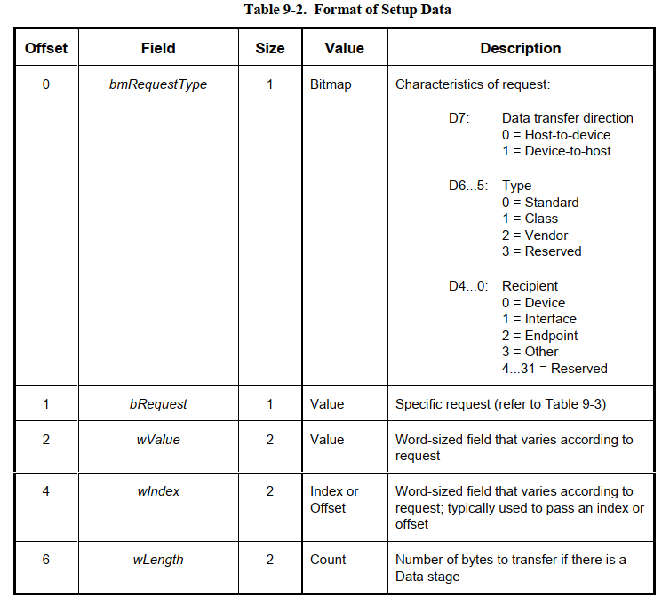
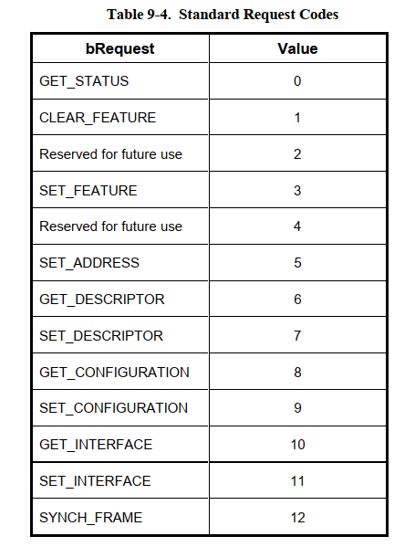
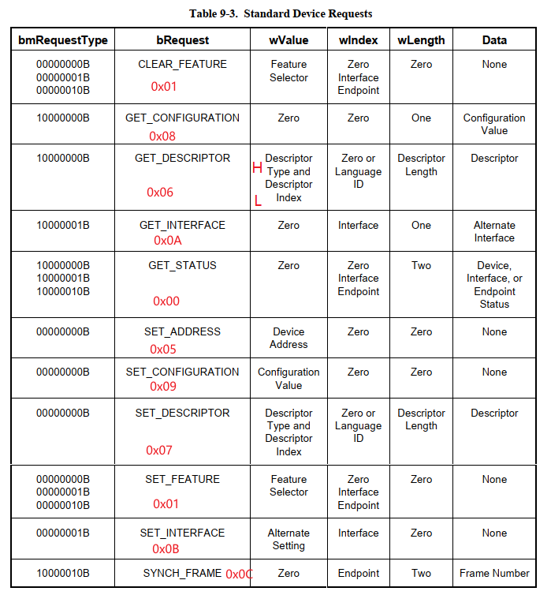

========================
USB Standard Request
========================

USB标准请求
============

------------
USB标准请求
------------

USB定义了8个字节的标准请求，通过这些请求，可以对设备的状态进行更改或对设备进行枚举。

USB的标准请求的数据传输方式都是 **Control Transfers** 方式，所以使用的端点是设备的默认端点0。

---------------------
USB标准请求的数据结构
---------------------

.. code-block:: c
    :linenos:

    typedef struct
    {
        uint8_t bmRequestType;
        uint8_t bRequest;
        uint16_t wValue;
        uint16_t wIndex;
        uint16_t wLength;
    } __attribute__ ((packed))   MUSB_DeviceRequest;

bmRequestType
--------------

 - D7: Data transfer direction

   - 0 = Host-to-device
   - 1 = Device-to-host
 - D[6:5]: Type

   - 0 = Standard
   - 1 = Class
   - 2 = Vendor
   - 3 = Reserved
 - D[4:0]: Recipient

   - 0 = Device
   - 1 = Interface
   - 2 = Endpoint
   - 3 = Other
   - 4...31 = Reserved

bRequest
------------

----------------
USB标准请求列表
----------------

