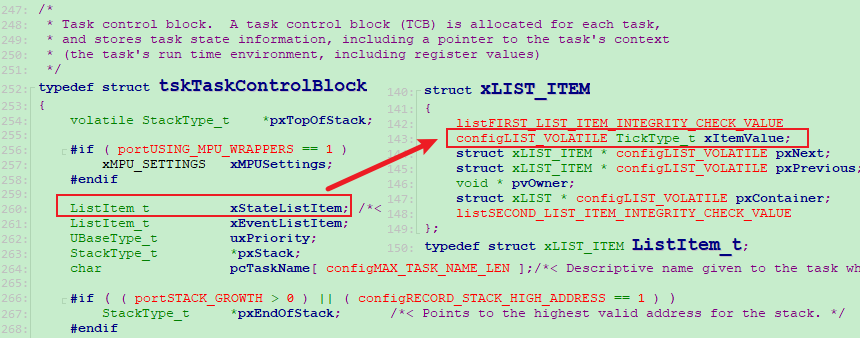

==============
任务阻塞/唤醒
==============

vTaskDelay
===========

主要做两件事：
 - 把自己从ready list移除，放入delayed list
 - 触发调度

.. code-block:: c
    :linenos:

    void vTaskDelay( const TickType_t xTicksToDelay )
    {
        BaseType_t xAlreadyYielded = pdFALSE;

        /* A delay time of zero just forces a reschedule. */
        if( xTicksToDelay > ( TickType_t ) 0U )
        {
            configASSERT( uxSchedulerSuspended == 0 );
            vTaskSuspendAll();
            {
                traceTASK_DELAY();

                /* A task that is removed from the event list while the
                scheduler is suspended will not get placed in the ready
                list or removed from the blocked list until the scheduler
                is resumed.

                This task cannot be in an event list as it is the currently
                executing task. */
                /* 把自己从ready list移除，放入delayed list */
                prvAddCurrentTaskToDelayedList( xTicksToDelay, pdFALSE );
            }
            /* 要么在这函数发起调度 */
            xAlreadyYielded = xTaskResumeAll();
        }
        else
        {
            mtCOVERAGE_TEST_MARKER();
        }

        /* Force a reschedule if xTaskResumeAll has not already done so, we may
        have put ourselves to sleep. */
        if( xAlreadyYielded == pdFALSE )
        {
            /* 要么在这函数发起调度 */
            portYIELD_WITHIN_API();
        }
        else
        {
            mtCOVERAGE_TEST_MARKER();
        }
    }

重点看下 ``Line 21`` ``Line 24`` ``Line 36`` .

-------------
delayed list
-------------

难点在于：有两个delayed list
 - pxDelayedTaskList：指向当前的delayed list
 - pxOverflowDelayedTaskList：指向溢出的delayed list

如下代码所示。 ``Line 1-2``

.. code-block:: c
    :linenos:

    PRIVILEGED_DATA static List_t * volatile pxDelayedTaskList;            /*< Points to the delayed task list currently being used. */
    PRIVILEGED_DATA static List_t * volatile pxOverflowDelayedTaskList;    /*< Points to the delayed task list currently being used to hold tasks that have overflowed the current tick count. */

    static void prvInitialiseTaskLists( void )
    {
        UBaseType_t uxPriority;

        for( uxPriority = ( UBaseType_t ) 0U; uxPriority < ( UBaseType_t ) configMAX_PRIORITIES; uxPriority++ )
        {
            vListInitialise( &( pxReadyTasksLists[ uxPriority ] ) );
        }

        vListInitialise( &xDelayedTaskList1 );
        vListInitialise( &xDelayedTaskList2 );
        vListInitialise( &xPendingReadyList );

        #if ( INCLUDE_vTaskDelete == 1 )
        {
            vListInitialise( &xTasksWaitingTermination );
        }
        #endif /* INCLUDE_vTaskDelete */

        #if ( INCLUDE_vTaskSuspend == 1 )
        {
            vListInitialise( &xSuspendedTaskList );
        }
        #endif /* INCLUDE_vTaskSuspend */

        /* Start with pxDelayedTaskList using list1 and the pxOverflowDelayedTaskList
        using list2. */
        pxDelayedTaskList = &xDelayedTaskList1;
        pxOverflowDelayedTaskList = &xDelayedTaskList2;
    }

上面代码是初始化， ``Line 31-32`` ``pxDelayedTaskList`` 和 ``pxOverflowDelayedTaskList`` 都是list指针，分别指向不同的list。

---------------------------
为什么要有2个 delayed list
---------------------------

在 delayed list 中，那些任务有1个 ``wakeup time`` ,这个 ``wakeup time`` 存储在哪里？

链表项里，有一个 ``xItemValue`` ，对于 blocked 的任务，会在上图的 ``xItemValue`` 里保存它的 ``wakeup time``

::

                    -----    -----    -----
    delayed list -> |   | -> |   | -> |   |
                    -----    -----    -----
                     100      200      300

    ----|----|----|----|----|----|----|----|----|---->t
       tick ++

如上图所示，沿着时间会不断地发生systick中断，中断函数里：tickCount++

当tickCount等于100时，delayed list中第一个任务被唤醒

问题1：tickCount=200，然后调用：vTaskDelay(250)；当前任务的 ``wakeup time`` 等于多少？

vTaskDelay(n)：阻塞n个tick，它的唤醒时间就是：当前tick + n，上面的例子就是：唤醒时间 = 200 + 250 = 450。会根据wakeup time，放入上图delayed list的最后面。

问题2：假设tickCount=200，然后调用：vTaskDelay(0xffffffff)，那么当前的任务的 ``wakeup time`` 等于多少？

200 + 0xffffffff = 199，溢出了，唤醒时间：199，小于当前tick 200，此时，我们就需要将这个任务放入另一个delayed list： ``pxOverflowDelayedTaskList``。

--------------------------------
prvAddCurrentTaskToDelayedList
--------------------------------

.. code-block:: c
    :linenos:

    static void prvAddCurrentTaskToDelayedList( TickType_t xTicksToWait, const BaseType_t xCanBlockIndefinitely )
    {
        TickType_t xTimeToWake;
        const TickType_t xConstTickCount = xTickCount;

        /* Remove the task from the ready list before adding it to the blocked list
        as the same list item is used for both lists. */
        if( uxListRemove( &( pxCurrentTCB->xStateListItem ) ) == ( UBaseType_t ) 0 )
        {
            /* The current task must be in a ready list, so there is no need to
            check, and the port reset macro can be called directly. */
            portRESET_READY_PRIORITY( pxCurrentTCB->uxPriority, uxTopReadyPriority ); /*lint !e931 pxCurrentTCB cannot change as it is the calling task.  pxCurrentTCB->uxPriority and uxTopReadyPriority cannot change as called with scheduler suspended or in a critical section. */
        }
        else
        {
            mtCOVERAGE_TEST_MARKER();
        }

        /* Calculate the time at which the task should be woken if the event
        does not occur.  This may overflow but this doesn't matter, the kernel
        will manage it correctly. */
        xTimeToWake = xConstTickCount + xTicksToWait;

        /* The list item will be inserted in wake time order. */
        listSET_LIST_ITEM_VALUE( &( pxCurrentTCB->xStateListItem ), xTimeToWake );

        if( xTimeToWake < xConstTickCount )
        {
            /* Wake time has overflowed.  Place this item in the overflow list. */
            vListInsert( pxOverflowDelayedTaskList, &( pxCurrentTCB->xStateListItem ) );
        }
        else
        {
            /* The wake time has not overflowed, so the current block list is used. */
            vListInsert( pxDelayedTaskList, &( pxCurrentTCB->xStateListItem ) );

            /* If the task entering the blocked state was placed at the head of the
            list of blocked tasks then xNextTaskUnblockTime needs to be updated
            too. */
            if( xTimeToWake < xNextTaskUnblockTime )
            {
                xNextTaskUnblockTime = xTimeToWake;
            }
            else
            {
                mtCOVERAGE_TEST_MARKER();
            }
        }

        /* Avoid compiler warning when INCLUDE_vTaskSuspend is not 1. */
        ( void ) xCanBlockIndefinitely;
    }

代码分析：
 - Line 8：从 ready list 移除
 - Line 22：计算 wakeup time
 - Line 25：设置链表项 xItemValue 为 wakeup time
 - Line 27-31：如果溢出，则放入 ``pxOverflowDelayedTaskList``
 - Line 32-35：未溢出，则放入 ``pxDelayedTaskList``

唤醒任务
=============

一个任务调用 ``vTaskDelay(10)`` ，那么10个tick之后，它就会被唤醒：
 1. 从 delayed list 放入 ready list
 2. 如果它的优先级比较高，还要触发一次调度

代码的源头在 SysTick 中断函数。

.. code-block:: c
    :linenos:

    void xPortSysTickHandler( void )
    {
        /* The SysTick runs at the lowest interrupt priority, so when this interrupt
        executes all interrupts must be unmasked.  There is therefore no need to
        save and then restore the interrupt mask value as its value is already
        known - therefore the slightly faster vPortRaiseBASEPRI() function is used
        in place of portSET_INTERRUPT_MASK_FROM_ISR(). */
        vPortRaiseBASEPRI();
        {
            /* Increment the RTOS tick. */
            if( xTaskIncrementTick() != pdFALSE )
            {
                /* A context switch is required.  Context switching is performed in
                the PendSV interrupt.  Pend the PendSV interrupt. */
                portNVIC_INT_CTRL_REG = portNVIC_PENDSVSET_BIT;
            }
        }
        vPortClearBASEPRIFromISR();
    }