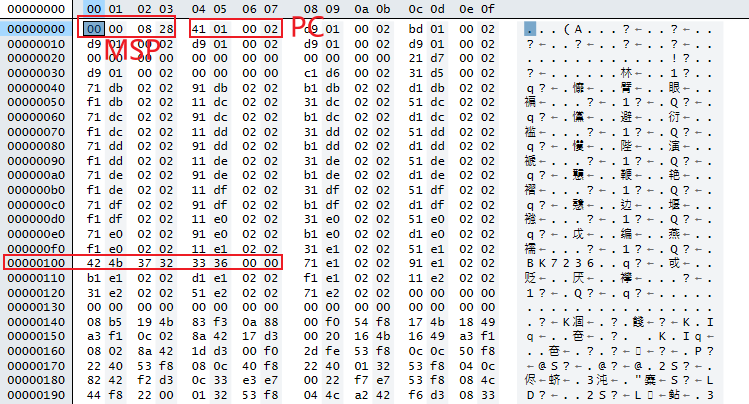
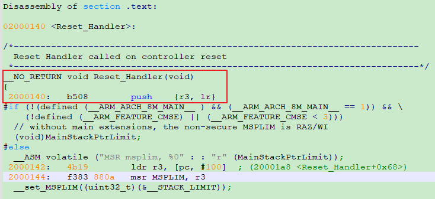
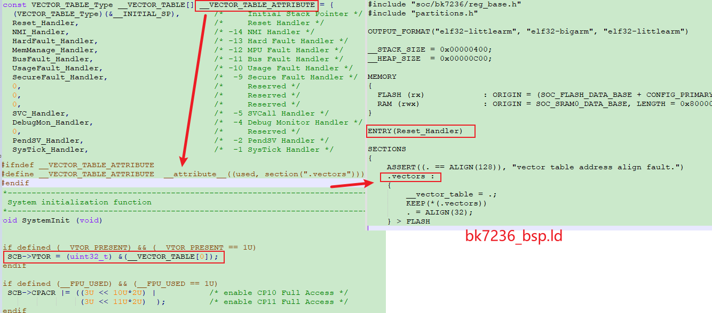

===========
BSP
===========

startup
========

目标：Bk7236 MPW1芯片 烧录bin后能跑起来，能进到 Reset_Handler。
能跑起来的判断标准，在 Reset_Handler 中拉高拉低GPIO，通过逻分观察相应GPIO是否被拉高拉低，以来确定程序是否走到了Reset_Handler。

------------
startup.bin
------------

从bin文件的角度来看，能跑起来 ``bin`` 文件需要满足的特征：

  - 第1个4字节(地址0x00000000)为MSP的初始值，MSP的初始值=0x28080000，通过address_mapping可以看到，SRAM地址范围 0x28000000~0x2807FFFF
  - 第2个4字节(地址0x00000004)为复位向量的地址，PC=[0x02000140](PC等于地址0x02000140里面的值)
  - **0x00000100 为芯片的magic number (bk7236)**，硬件会读这个地址看有没有bin文件，有的话才会往下执行。没有该值，该bin就无法正常执行

-------------
vector_table
-------------

向量表默认从地址0开始，向量地址则为异常编号乘4。启动代码中使用的向量表还包含MSP的初始值，这种设计是很有必要的，因为NMI等异常可能会紧接着复位产生，需要入栈保存异常信息。

在启动代码中，关于向量表的操作如下：

 - 设置VTOR ``SCB->VTOR = (uint32_t)&(__VECTOR_TABLE[0])``
 - 将 vector_table 放在flash 0 地址处：将向量表放在 .vectors 段，.vectors 放在flash 一开始的地方(地址0)

