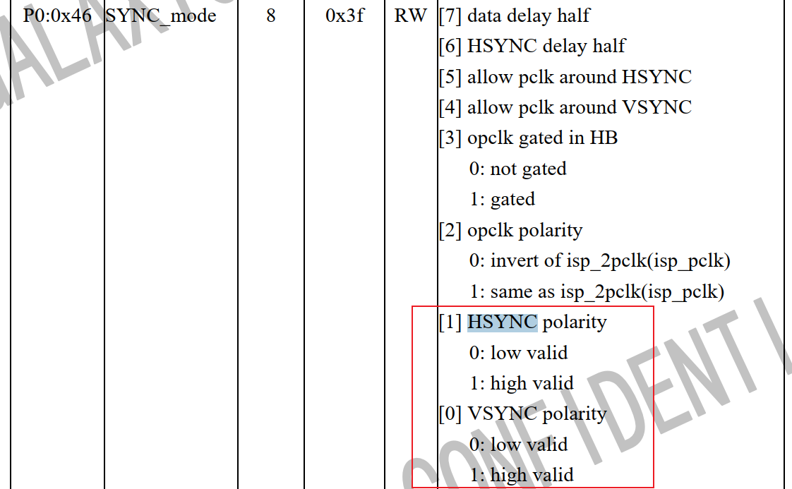
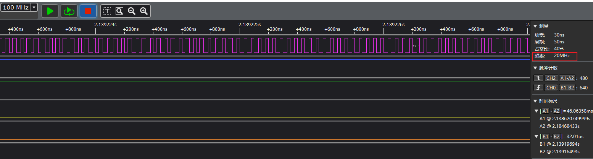
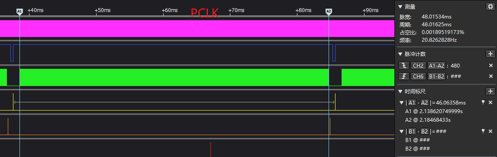

=====
dvp
=====

DVP (digital video port)

CIS DVP 接口，支持720P 25fps，1080p 12fps

Supported sensors could be but not limited to OV7676, OV7670, GC0308, GC0309, GC0329 and PAS6329.
The sensor YUV input will be directly fed to the hardware JPEG encoder, and the JPEG encoder output will be write to data
memory directly by a dedicated DMA channel.
The YUV signal format could be YUYV, UYVY, YYUV and UVYY. HSYNC and VSYNC level could be set
independently.

信号线
=======

以 gc0328c 摄像头为例：

 - MLCK：输入给sensor的时钟，需 soc 提供
 - PCLK: sensor 输出的时钟，会给到我们的yuv_buf,jpeg,h264等模块
 - VSYNC: 帧同步，一帧数据
 - HSYNC：行同步

.. note::
   关于VSYNC，HSYNC 是低电平有效，还是高电平有效，是可以通过配置camera的寄存器来配置的。

gc0328c 调试
=============

以下内容摘自 datasheet：

The GC0328 features 640V x 480H resolution with 1/6.5-inch optical format,
and 4-transistorpixel structure for high image quality and low noise variations. It
delivers superior image quality by powerful on-chip design of a 10-bit ADC, and
embedded image signal processor.

The product is capable of operating at up to 30 fps at 24MHZ clock in VGA
mode, which can be completely controlled by user over image quality and data
format.

从上可以看到两个对我们使用相关的信息：
 - 分辨率 640x480。因此我们后面设置 jpeg_enc 的 x_pixel = 640/8, y_pixel=480/8
 - MLCK 24MHZ。芯片给到sensor mclk 的典型值为24MHz.

.. note::
   实际调试发现24MHz，GC0328C i2c 通信出错率很高，因此后面调到了20MHz。

   对于 GC0328C 来说输入MCLK=20MHz，输出PCLK也是20MHz。

因此，gc0328c 调试时要关注的内容：
 - PLCK 是否为20MHz
 - 一帧数据里面的 HSYN C脉冲数 是否为480 (sensor 分辨率为640x480)
 - 一行数据里面的 PLCK 脉冲数 是否为640

-------
PCLK
-------

如下图所示，PCLK为20MHz。

.. note::
   要想抓到20MHz的波形，逻分的时钟至少要设为40MHz。

-----------------
HSYNC 脉冲数
-----------------

如下图所示，蓝色的为VSYNC，绿色的为HSYNC，通过逻分的右上角可以方便的看到：一帧数据中，有480个脉冲

-----------------
PCLK 脉冲数
-----------------

bk7236 芯片配置
================

---------
时钟相关
---------

1. yuv, jpeg, h264 时钟都要打开，即 system 里面的 clk_en 都要设置为1
2. 时钟选择：system_reg8[30] 选择320M/480M，system_reg[29:26] 配置分频系数

     假设选择 480M，分频系数=3，那么
       - H264的时钟就是480M/4=120M，
       - JPEG,YUV 的时钟源是 H264 的时钟源再2分频，即JPEG,YUV 的时钟源为60M
3. mclk 配置：在yuv_buf_reg0x4[11:10]配分频系数，在60M(步骤2配的yuv_buf的时钟源)的基础上在分频

---------
测试流程
---------

1. 输出 mclk 给到 camera, dvp_camera clock
2. dvp_camera i2c_init
3. dvp_camera get_chip_id
4. dvp_camera open

Q&A
======

1. GC0328C 写 slave_address(0x42)，camera不回ACK。

   camera正常工作需要电源跟MCLK，检查这两个地方是否正常。

   - AVDD28：模拟供电电源 2.8V
   - IOVDD：I/O 电源 2.8V
   - DVDD：数字供电电源 1.8V