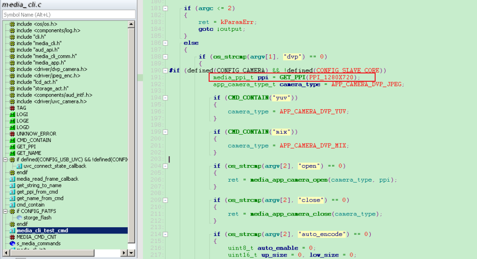
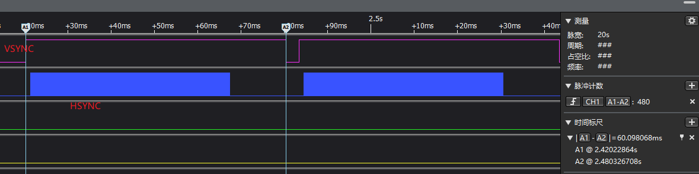
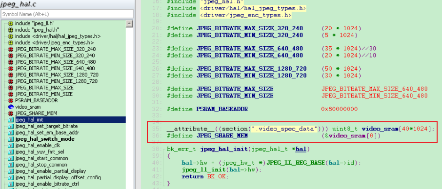

===============
jpeg 调试记录
===============

概述
======

通过 dvp camera 过来的数据，会有三种处理方式，对应芯片里面的硬件模块：
  - yuv_buf
  - jpeg_enc
  - h264

这些模块依赖于 sensor 输出的 **PCLK** (一般是20M这个级别)。

---------
yuv mode
---------

sensor 过来的数据(yuv/rgb data)，倒手一波，放在 ``em_base_addr`` 里面，因为数据量比较大，因此通常是 ``PSRAM`` 的地址(0x60000000)。

----------
jpeg mode
----------

sensor 过来的数据，进行 JPEG 压缩，因此需要一个地方来处理数据，这个就是 ``em_base_addr`` 设置的地方，通常是 ``share_memory`` ，因为需要速度够快。

压缩完成后的数据放在 ``jpeg_enc`` 的 ``rx_fifo_data`` 里面，因此读这个fifo就可以得到压缩处理后的数据。通常通过DMA来搬。

JPEG 模式
===========

工作正常的指标：

 - byte_count_pfrm 一直变化
 - rx_fifo_data 一直变化
 - sof , eof 这两个中断都一直产生

cli 命令
========

sensor->JPEG_ENC->JPEG_DEC->LCD

.. code:: text

   media dvp open
   media lcd open

JPEG 调试记录
=====================

1. JPEG 模块是否工作正常主要关注：
   - REG_0x7 byte_count_pfrm(bit[0:31]): the byte number of every frame，JPEG 正常工作起来后这个值会不停的变化
   - REG_0x5 rx_fifo_data(bit[0:31]): jpeg encoder output data, JPEG 正常工作起来后这个值也会不停的变化

2. JPEG 配置
   - REG_0x4 eof_offset=0x20
   - REG_0xC
   - REG_0xD bit[1] video_byte_reverse=1
   - REG_0xD bit[8:15] x_pixel=40，bit[24:31] y_pixel=60 (320*480)

3. 配置GC2145分辨率为 1280*720

4. 如何确认当前的分辨率已经设置成了720p

如下图所示，可以通过 HSYNC 脉冲数，一帧数据有480个 HSYNC 脉冲，即当前是480P

5. JPEG_ENC 需要设置 em_base_addr 为share memory 地址，用来处理数据，那么需要占用多大内存？

一次是8条Line，可以理解为8行数据，因为是乒乓buffer，所以是8x2，以640x480为例，8x2x640x2=20K Bytes。

1280x720 则为8x2x1280x2=40K Bytes。

YUV 422，一个pixel占2byte

6. dvp_camera.c 中 JPEG_ENC 数据流

编码出来的数据在 JPEG_RX_FIFO，psram 缓存已经编码完成的数据。都是通过DMA来完成数据的搬运。

JPEG_RX_FIFO->share memory->psram

7. JPEG_ENC 局部编码功能

JPEG_ENC, YUV_BUF 里面的 partial 都需要设置

.. code-block:: c

调试中遇到的问题
===================

1. JPEG_ENC 无eof中断产生，byte_count_pfrm 一直是0

JPEG 没工作起来

 - jpeg_en 使能，yuv_mode disable
 - jpeg 分辨率跟摄像头分辨率配置一致
 - camera init 后延时一段时间再去打开GPIO 的VSYNC,HSYNC
 - clock_gate_bypass 打开
 - em_base_addr 正确设置，一般设为 share memory 地址，0x28xx,xxxx

.. note::
   如果还是没工作起来，可以出软件让数字帮忙仿真。MPW2当前遇到的问题是蓝牙对JPEG编码有影响，屏蔽后可正常工作。