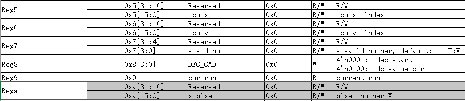
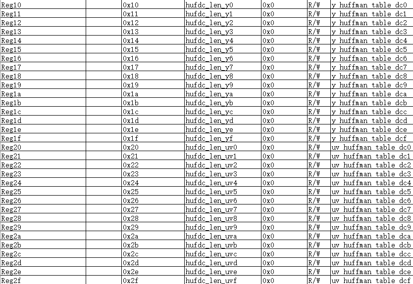
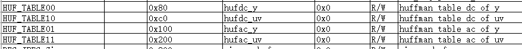
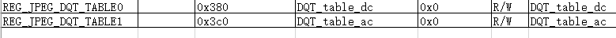

============
JPEG 解码
============

JPEG 压缩文件
================

Jpeg压缩文件包括头文件和数据两部分。

头文件包含一些解码数据需要的信息。

 - FFD8表示一帧图像开始，
 - FFDB表示量化表，
 - FFC4表示霍夫曼表，
 - FFDA表示start of scan（数据开始），
 - FFD9表示图像结束。
 - 还有一些DRI，比如FFD0~FFD7，表示重置解码

BK_JPEGDEC 功能划分
========================

JPEG_DEC的头文件是软件解析的，软件分析头文件主要得到

 - 图像大小
 - 格式
 - 霍夫曼表
 - 量化表

得到的信息配置到相应的寄存器和memory中，如图像大小写入x_pixel。

霍夫曼表长度写入0x10~0x4f

霍夫曼表写入首地址0x80，0xc0，0x100, 0x200的memory。

量化表写入首地址0x380，0x3c0的memory。

.. note::

    目前jpegdec只支持4:2:2的yuv格式。

JPEG_DEC的数据是硬件加速的，以block为单位，一个block大小是8x8。

 - 1080P  block = 1920*1080*2/64 = 64800
 - 720P   block = 1280*720*2/64 = 28800
 - 480P   block =640*480*2/64 = 9600
 - 320P   block =320*240*2/64 = 2400

Block处理的顺序是yyuvyyuv……，从左到右， 从上到下。

每个block硬件加速完后产生一个中断，在中断里要处理一些参数，比如每处理完一行block后，寄存器reg_mcu_y=reg_mcu_y + 8。

每处理完一组yyuv block后，寄存器reg_mcu_x = reg_mcu_x + 16。处理yy数据时reg_jpeg_dcvu =0，处理vu数据时reg_jpeg_dcvu =1.一帧图像处理完成后reg_mcu_y，reg_mcu_x，reg_jpeg_dcvu都要复位到0。
