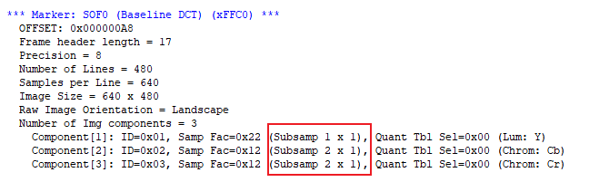
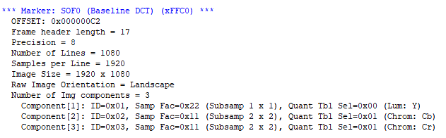

============
JPEG 解码
============

JPEG 格式详解
================

JPEG文件大体上可以分成两个部分：标记码(Tag)和压缩数据。

标记码由两个字节构成，其前一个字节是固定值0xFF，后一个字节则根据不同意义有不同数值。在每个标记码之前还可以添加数目不限的无意义的0xFF填充，也就说连续的多个0xFF可以被理解为一个0xFF，并表示一个标记码的开始。而在一个完整的两字节的标记码后，就是该标记码对应的压缩数据流，记录了关于文件的诸种信息。

常用的标记有SOI、APP0、DQT、SOF0、DHT、DRI、SOS、EOI。

注意，SOI等都是标记的名称。在文件中，标记码是以标记代码形式出现。例如SOI的标记代码为0xFFD8，即在JPEG文件中的如果出现数据0xFFD8，则表示此处为一个SOI标记。

https://blog.csdn.net/u010192735/article/details/120867340

JPEG 压缩文件
================

JPEG压缩文件包括 **头文件** 和 **数据** 两部分。

头文件包含一些解码数据需要的信息。

 - FFD8表示一帧图像开始，
 - FFDB表示量化表，
 - FFC4表示霍夫曼表，
 - FFDA表示start of scan（数据开始），
 - FFD9表示图像结束。
 - 还有一些DRI，比如FFD0~FFD7，表示重置解码

BK_JPEGDEC 功能划分
========================

JPEG_DEC的头文件是软件解析的，软件分析头文件主要得到

 - 图像大小
 - 格式
 - 霍夫曼表
 - 量化表

得到的信息配置到相应的寄存器和memory中，如图像大小写入x_pixel。

霍夫曼表长度写入0x10~0x4f

霍夫曼表写入首地址0x80，0xc0，0x100, 0x200的memory。

量化表写入首地址0x380，0x3c0的memory。

.. note::

    目前jpegdec只支持4:2:2的yuv格式。

JPEG_DEC的数据是硬件加速的，以block为单位，一个block大小是8x8。

 - 1080P  block = 1920*1080*2/64 = 64800
 - 720P   block = 1280*720*2/64 = 28800
 - 480P   block =640*480*2/64 = 9600
 - 320P   block =320*240*2/64 = 2400

Block处理的顺序是yyuvyyuv……，从左到右， 从上到下。

每个block硬件加速完后产生一个中断，在中断里要处理一些参数，比如每处理完一行block后，寄存器 ``reg_mcu_y=reg_mcu_y + 8``。

每处理完一组yyuv block后，寄存器reg_mcu_x = reg_mcu_x + 16。处理yy数据时reg_jpeg_dcvu =0，处理vu数据时reg_jpeg_dcvu =1.一帧图像处理完成后reg_mcu_y，reg_mcu_x，reg_jpeg_dcvu都要复位到0。

VGA QVGA 720P 1080P
========================

VGA QVGA 720P 1080P 分别是什么意思？

这些是视频分辨率的常见标准：

 - VGA（Video Graphics Array）指的是640 x 480像素的分辨率，它是一种传统的计算机屏幕分辨率标准。
 - QVGA（Quarter Video Graphics Array）指的是320 x 240像素的分辨率，它通常用于较小的设备，如移动电话和便携式游戏机。
 - 720P指的是高清视频标准之一，分辨率为1280 x 720像素，其中“P”表示“逐行扫描”（progressive scan），也就是视频画面从上到下逐行扫描显示。
 - 1080P也是高清视频标准之一，分辨率为1920 x 1080像素，同样，“P”表示“逐行扫描”，即视频画面从上到下逐行扫描显示。

cli 测试命令
===============

从SD卡里面读取一张JPEG图，经过JPEG_DEC显示到LCD上。

.. code:: text

    fatfstest M 1 //挂载上fatfs文件系统
    fatfstest S 1
    lcd file_display positive_new.jpg 0
    media lcd display positive_new.jpg

.. note::

    我们的JPEG_DEC模块只支持YUV4:2:2的，不支持YUV4:2:0

JPEG 工具推荐
================

JPEGsnoop

JPEG 422

JPEG 420