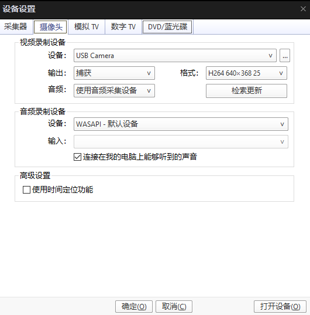

===============
uvc 调试记录
===============

uvc camera
============

需要实现的功能：

bk7236作为usb device，dvp camera 采集到的内容经过H264模块压缩后，
通过 **uvc** class 将 **h264** raw data 传输给windows，windows解析出来并播放。（也就是bk7236作为摄像头）

.. note::
    该功能基于 cherry_usb 协议栈实现，如何port cherry usb，可以看其官网文档。

调试工具：

 - Pot Player，用来播放camera的内容（打开->设备设置->摄像头->选择对应格式->打开设备）
 - Elecard StreamEye Tools，用来解析H264数据(xxx.h264)
 - ffmpeg，我只是用来从MP4文件中提取h264数据，其实它的功能很强大
 - USB packet Viewer，USB抓包工具
 - BusHound，主机收到的数据
 - usbviewer，可以用来分析UVC摄像头的描述符

推荐资源：

 - https://www.usbzh.com/article/forum-6.html
 - 几个QQ群：642693751(Cherry USB讨论群)，952873936(USB中文网技术交流群)

基本使用
==========

1. 硬件连接：

 - dvp camera 插入 dvp camera 接口
 - usb 连接电脑跟板子
 - 跳线帽 如图所示

.. figure:: ../_static/uvc_device_hardware_connect.png
    :align: center
    :alt: Images
    :figclass: align-center

2. 使用步骤：

 - 打开宏 ``CONFIG_CHERRY_USB``, ``CONFIG_USB_DEVICE``, ``CONFIG_USB_UVC``, 可在project下配置
 - 相关cli命令在 ``cli_h264.c`` 文件中，将宏 ``H264_UVC`` 设为0

3. cli 命令顺序：

 - h264_init encode
 - h264_usb camera，该命令将dvp camera（gc0328c 640x480 25fps）采集到的数据，经过芯片内的H264模块压缩后，通过USB发送给电脑，电脑pot player软件解析播放

或者只发送如下命令，用来测试 USB 作为 device，传输 H264 数据给电脑。

  - h264_usb local，该命令将flash保存的h264 raw data 通过 usb 发送给 电脑，可以通过PC软件Pot player播放h264视频数据

上述两套命令根据实际需求二选一。

4. Pot player 如何播放camera的内容？

打开->设备设置->摄像头->格式选择->打开设备

5. 如何将 H264 数据当作 .bin 文件烧录进flash？

 - 将 h264.bin 拷贝到 build/spe/bk7236/_build 目录下
 - 修改 spe/config/partitions/partitions.json

.. code-block:: json

    {
        "description": "NS BL1 -> Armino S",
        "partitions": [
            { "partition": "primary_app",  "offset": "0x00000000", "size": "1536k", "bin": "app.bin",  "bin_type": "code", "version": "0x00010001"}
        ]
    }

    {
        "description": "NS BL1 -> Armino S",
        "partitions": [
            { "partition": "primary_app",  "offset": "0x00000000", "size": "1564k", "bin": "app.bin",  "bin_type": "code", "version": "0x00010001"},
            { "partition": "primary_ns",   "offset": "0x187000", "size": "68k", "bin": "h264.bin",        "bin_type": "code", "version": "0x00010001"}
        ]
    }

修改如下：

 - partition size：1536k->1564k，需要68 byte对齐，1536k/64=24，因为MPC flash的block size是64 byte，23*68=1564k=0x187000
 - 程序里面想用指针访问这段数据该访问哪个地址？0x187000/34*32=0x170000，flash地址从0x02000000开始，最终地址为 0x02000000+0x170000=0x02170000

两个地址概念：

 - 虚拟地址：去CRC后的地址，程序里面通过指针访问的地址，0x020017000
 - 物理地址：加了CRC后的地址，all.bin的地址，partiton 配的就是物理地址

uvc camera 描述符相关
======================
