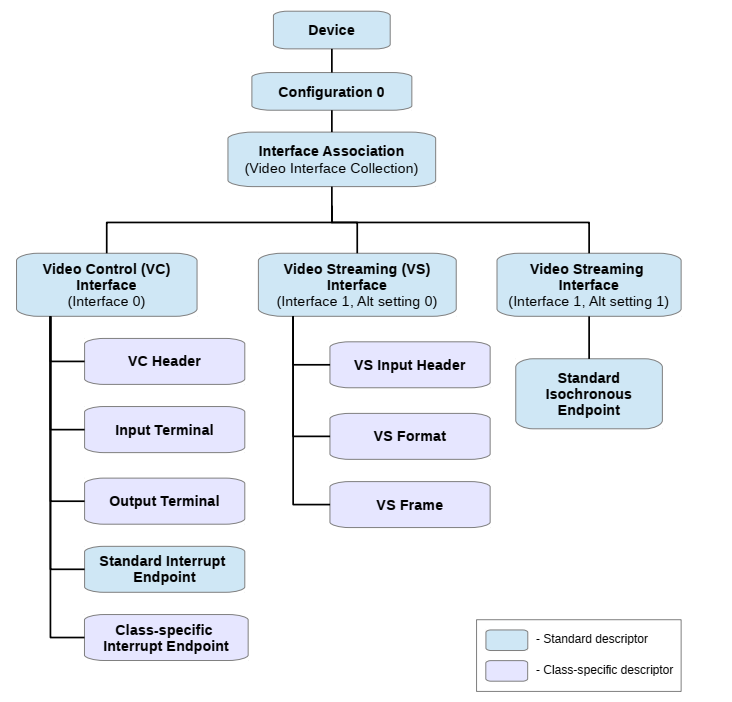

===============
uvc descriptor
===============

概述
=======

多个接口一起提供视频功能。这组接口称为视频接口集合。视频接口集合由接口关联描述符（IAD）描述。

在示例应用程序中，IAD定义接口0和1分组以形成USB视频设备。这两个接口是：

 - 视频控制接口（VC接口）
 - 视频流接口（VS接口）

.. note::
    视频功能必须有一个视频控制接口和零个或多个视频流接口。

UVC设备的 device descriptor
==============================

对于包含一个或多个视频接口集合的设备，通常视频的功能常常在接口描述符中来定义。

但是由于使用了接口关联描述符描述视频接口集，所以必须设置：
 - bDeviceClass       0xEF
 - bDeviceSubClass    0x02
 - bDeviceProtocol    0x01

对于视频类设备，必须将“bDeviceClass”、“bDeviceSubClass”和“bDeviceProtocol”字段分别设置为0xEF、0x02和0x01

.. code-block:: c
    :linenos:

    typedef struct
    {
        uint8_t bLength;            //设备描述符的字节数大小，为0x12
        uint8_t bDescriptorType;    //描述符类型编号，为0x01
        uint16_t bcdUSB;
        uint8_t bDeviceClass;       //必须为 0xEF
        uint8_t bDeviceSubClass;    // 必须为0x02
        uint8_t bDeviceProtocol;    //必须为0x01
        uint8_t bMaxPacketSize0;
        uint16_t idVendor;
        uint16_t idProduct;
        uint16_t bcdDevice;
        uint8_t iManufacturer;
        uint8_t iProduct;
        uint8_t iSerialNumber;
        uint8_t bNumConfigurations;
    } __attribute__ ((packed))  MUSB_DeviceDescriptor;

UVC 接口关联描述符IAD
======================

.. code-block:: c
    :linenos:

    typedef struct {
        uint8_t bLength;            //长度为8
        uint8_t bDescriptorType;    //USB_INTERFACE_ASSOCIATION_DESCRIPTOR_TYPE，值为0x0b
        uint8_t bFirstInterface;
        uint8_t bInterfaceCount;
        uint8_t bFunctionClass;
        uint8_t bFunctionSubClass;
        uint8_t bFunctionProtocol;
        uint8_t iFunction;
    } __attribute__ ((packed))  MUSB_InterfaceAssociationDescriptor;

UVC 端点描述符
======================