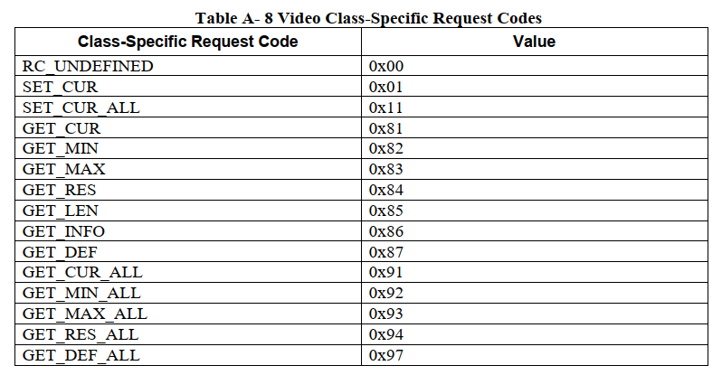

=============
uvc request
=============

请求是主机软件与实体中控制器交流的一种机制。请求都是由主机向设备端发起的功能请求，所有的USB设备都需要支持标准的设备请求和与Class相关的特殊类请求。

 - 标准请求: 在标准协议中有相关描述，不做详细展开
 - 特殊类请求: 事实上特殊类请求也可以根据接口来分成两大类：

    - 视频控制请求.
    - 视频流请求。

视频控制请求
==============

视频控制请求有：

 - 接口控制请求（Interface Control Request）
 - 相机终端控制请求（Camera Terminal Control Request）
 - 选择单元控制请求（Selector Unit Control Request）
 - 处理单元控制请求（Processing Unit Control Request）
 - 扩展单元控制请求（Extension Unit Control Request）

视频流请求仅有接口控制请求(Interface Control Request).
======================================================