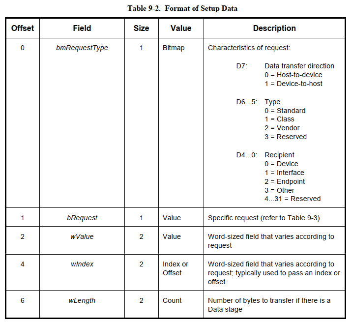
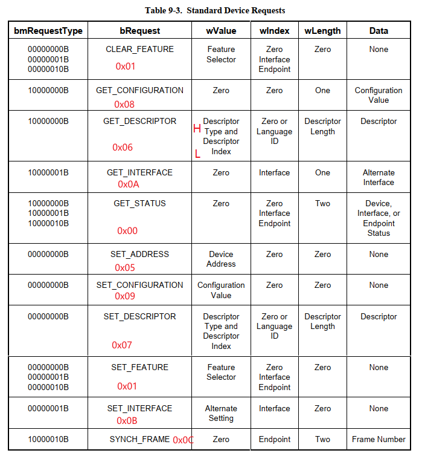
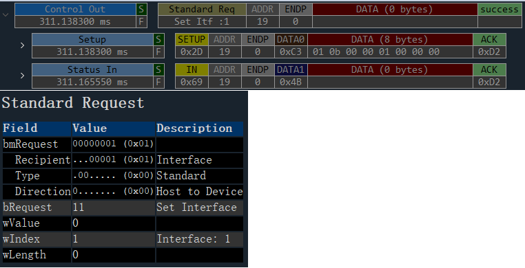
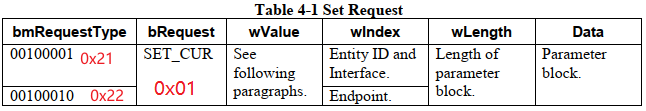
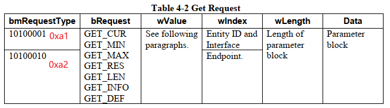

=============
uvc request
=============

请求是主机软件与实体中控制器交流的一种机制。请求都是由主机向设备端发起的功能请求，所有的USB设备都需要支持标准的设备请求和与Class相关的特殊类请求。

 - Standard Requests: 在标准协议中有相关描述，不做详细展开
 - Class-specific Requests: 事实上 Class-specific Requests 也可以根据接口来分成两大类：

    - VideoControl Requests
    - VideoStreaming Requests

Standard Requests
====================

以 standard_set_interface_request 为例

Class-specific Requests
===========================

.. figure:: ../_static/video_class_request_codes.png
    :align: center
    :alt: Images
    :figclass: align-center

以下段落描述了Set和Get请求的一般结构。

-------------
Set Request
-------------

The bRequest field contains a constant that identifies which attribute of the addressed Control is
to be modified. Possible attributes for a Control are:

 - Current setting attribute (SET_CUR)

-------------
Get Request
-------------

The bRequest field contains a constant that identifies which attribute of the addressed Control or
entity is to be returned. Possible attributes for a Control are:

 - Current setting attribute (GET_CUR)
 - Minimum setting attribute (GET_MIN)
 - Maximum setting attribute (GET_MAX)
 - Default setting attribute (GET_DEF)
 - Resolution attribute (GET_RES)
 - Data length attribute (GET_LEN)
 - Information attribute (GET_INFO)