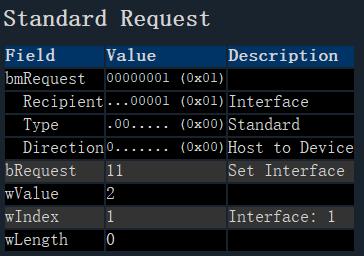
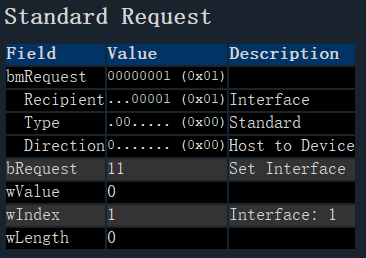
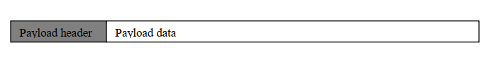
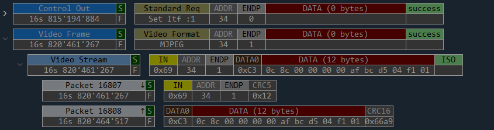
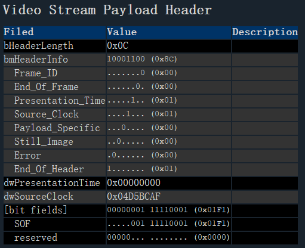
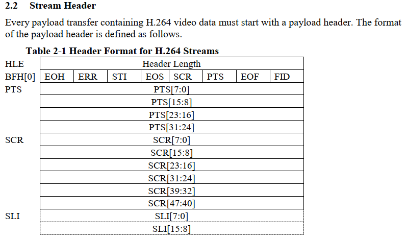

==============
uvc stream
==============

uvc camera open/close
=======================

打开时，数据抓包为：

.. code-block:: text
    :linenos:

    01 0B 02 00 01 00 00 00

停播放时，数据抓包为：

.. code-block:: text
    :linenos:

    01 0B 00 00 01 00 00 00

通过上面可以知道，打开或停止摄像头，是通过转换接口来实现的。

video stream payload Header
===============================

UVC数据传输时，每次USB传输，数据包中有一个负载数据头(Payload Header Information)，数据头后为有效的数据。其数据包格式见图：

负载数据头为最大为12个字节，包括固定的前2字节的负载数据头和10个字节的扩展负载数据头。

h264 stream payload header
============================

H264 payload data
====================

H264 payload 数据包括 使用 H.264 Annex B 字节流格式编码 并且面向字节 的视频。
payload传输大小是可变的，总的payload传输长度每次传输不得超过最大payload传输大小，
由 video Probe and Commit Control 中的 dwMaxPayloadTransferSize 字段指定。

Annex B字节流格式的原始H.264比特流是SCP序列加NALU对，可能在NALU数据之后有零字节填充。
一张图片的第一个SCP为4字节长。同一图片的每个后续SCP可以是3或4字节长。NALU具有可变大小。
每个NALU以NALU类型指示符开始。每个slice的压缩bit包含在单个NALU中。
一个视频帧可以是使用多个NALU表示，因为一个视频帧可以具有多个slice。
出现在H.264附录B字节流NALU末尾的零值字节，在H.264规范中被称为“trailing_zero_8bits”。
就本规范而言，此类零值字节被视为NALU的一部分。

一个NALU可以跨越多个payload传输。
如果payload传输包含slice的最后一个NALU的最后一个字节，EOS标志设置在payload header中。
不在包含此的NAL单元之外的payload传输中可以包含额外的字节最后一个slice。
新slice必须在不同的payload传输中开始。
slice数据将在SCP前面，并且可以在其他NALU前面（例如，SPS/PPS和/或SEI消息）。
当新捕获时间的数据开始传输时，FID在0和1之间切换，并且PTS/SCR必须设置在有效载荷报头中。
缓冲周期（BP）和画面定时（PT）补充增强信息（SEI）NALU可用于携带额外的基本比特流中的定时信息。
存在时，包含BP或PT的NALU SEI消息只能包含一个SEI消息。
包含BP SEI消息的NALU必须成为AU的第一个SEI NALU。
包含PT SEI消息的NALU必须是第一个SEI AU的NALU，而不是包含BP SEI消息的NALU（如果存在）。