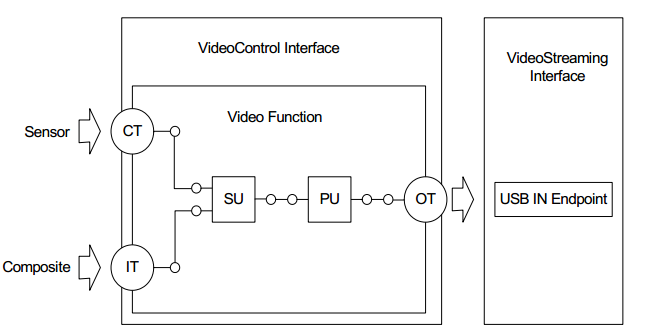
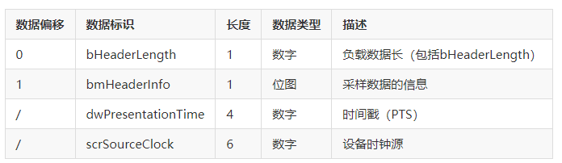

==============
uvc summary
==============

uvc 拓扑结构
================

This specification describes the following types of standard Units and Terminals that are
considered adequate to represent most video functions available today and in the near future:

 - Input Terminal(IT)
 - Output Terminal(OT)
 - Selector Unit(SU)
 - Processing Unit(PU)
 - Encoding Unit(EU)
 - Extension Unit(XU)

Also, there are certain special Terminals that extend the functionality of the basic Input and
Output Terminals. These special Terminals support additional Terminal Descriptor fields and
Requests that are specific to the extended features these Terminals provide. These include:

 - Media Transport Terminal
 - Camera Terminal(CT)

UVC摄像头设备拓扑结构
==========================

下面以一个UVC摄像头设备为例展现其拓扑结构的示例图如下：

从Sensor和另一个复合视频设备得到的数据流由IT和CT输入，经过SU选择送到PU处理，再由OT绑定到指定的USB端点。

同时从上面的拓扑结构图可以看出，左半部分框架组成了UVC中的 **VC接口部分** ，右半部分框架组成了 **VS接口部分**。

Payload Header Information
============================

摄像头数据包格式分析

UVC数据传输时，每次USB传输，数据包中有一个负载数据头(Payload Header Information)，数据头后为有效的数据。其数据包格式见图：

.. figure:: ../_static/data_format.png
    :align: center
    :alt: Images
    :figclass: align-center

Payload Header 最大为12个字节，包括固定的前2字节的负载数据头和10个字节的扩展负载数据头。

--------------------------------------
H264视频和静态图像有效载荷帧头数据示例
--------------------------------------

下面我们通过BUSBOUD抓取一个H264摄像头的数据并进行分析举例，这里我们每包只抓取前16个字节

.. code-block:: text
    :linenos:

    30.3  IN     0c 0c 00 00  00 00 00 00  00 00 00 00  00 00 00 01
    30.3  IN     0c 0c 00 00  00 00 00 00  00 00 00 00  2f fa b1 0a
    30.3  IN     0c 0c 00 00  00 00 00 00  00 00 00 00  69 c8 92 51
    30.3  IN     0c 0e 00 00  00 00 00 00  00 00 00 00  ed e7 3e 2c
    30    IN
    30.3  IN     0c 0d 00 00  00 00 00 00  00 00 00 00  00 00 00 01
    30.3  IN     0c 0d 00 00  00 00 00 00  00 00 00 00  ae 0c 8e 63
    30.3  IN     0c 0d 00 00  00 00 00 00  00 00 00 00  63 68 78 d0
    30.3  IN     0c 0f 00 00  00 00 00 00  00 00 00 00  d0 93 b5 aa
    30    IN
    30.3  IN     0c 0c 00 00  00 00 00 00  00 00 00 00  00 00 00 01
    30.3  IN     0c 0c 00 00  00 00 00 00  00 00 00 00  df ac 8a 22
    30.3  IN     0c 0c 00 00  00 00 00 00  00 00 00 00  55 e3 23 cc
    30.3  IN     0c 0e 00 00  00 00 00 00  00 00 00 00  3c f8 30 f4

可以看到，视频图像数据负载头长度为 ``0x0c`` 12个字节。

通过第二个字节的变化，可知抓取了3帧视频帧的数据，每帧数据分为4包。

第一帧从0C变成0E,其中起始帧位位0，变成0E后，结束帧置位。

第二帧从0d开始，可以看到起始帧位从第一帧的0变成了1.

而BIT2和BIT3都存在，却被填充了00.

UVC 视频流接口VS
=====================

和视频控制接口不同，视频流接口用于主机和设备视频功能之间进行传输视频数据。一个视频功能可以不包括视频流接口，也可以包含多个视频流接口。

 - 视频流接口用于传输视频时，其传输端点为等时/同步传输端点或者批量传输端点。
 - 视频流接口用于传输静止图像时，其传输类型为批量传输端点。用于静止图片传输是可选的，不是必须的。