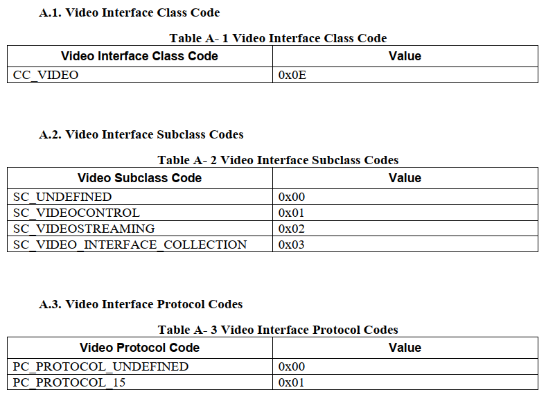
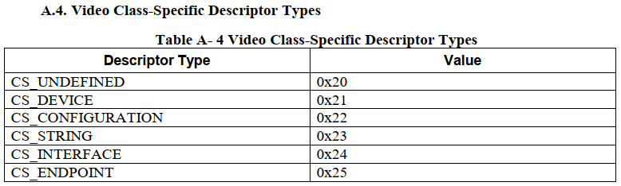
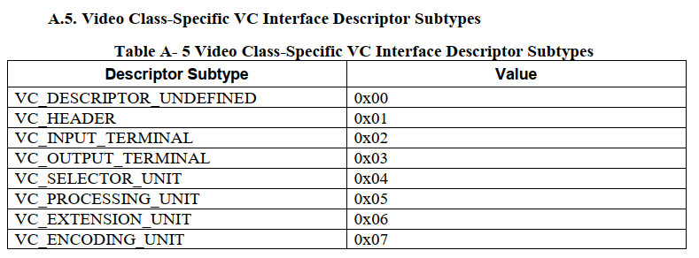

=========================
video control descriptor
=========================

Standard VC Interface Descriptor
====================================

.. code-block:: c
    :linenos:

    typedef struct
    {
        uint8_t bLength;            //设备描述符的字节数大小，为0x09
        uint8_t bDescriptorType;    //描述符类型编号，为0x04
        uint8_t bInterfaceNumber;
        uint8_t bAlternateSetting;
        uint8_t bNumEndpoints;
        uint8_t bInterfaceClass;
        uint8_t bInterfaceSubClass;
        uint8_t bInterfaceProtocol;
        uint8_t iInterface;
    } __attribute__ ((packed))  MUSB_InterfaceDescriptor;

各字段说明如下：

 - bLength : 描述符大小．固定为0x09．
 - bDescriptorType : 接口描述符类型．固定为0x04．
 - bInterfaceNumber: 该接口的编号,接口编号从0开始．
 - bAlternateSetting : 用于为上一个字段选择可供替换的位置．即备用的接口描述符编号．
 - bNumEndpoint : 使用的端点数目．端点0除外．
 - bInterfaceClass : 类型代码，固定为 **CC_VIDEO** ，值为0x0E．
 - bInterfaceSubClass : 子类型代码，固定为 **SC_VIDEOCONTROL** ，值为0x01．
 - bInterfaceProtocol : 协议代码, **PC_PROTOCOL_15** 为0x01, **PC_PROTOCOL_UNDEFINED** 未定义为0x00．
 - iInterface : 字符串描述符的索引

Class-specific VC Interface Header Descriptor
=================================================

.. code-block:: c
    :linenos:

    struct uvc_header_descriptor
    {
        uint8_t  bLength;
        uint8_t  bDescriptorType;       //描述符类型：CS_INTERFACE，值为0x24
        uint8_t  bDescriptorSubType;    //描述符子类型 VC_HEADER，值为0x01
        uint16_t bcdUVC;
        uint16_t wTotalLength;
        uint32_t dwClockFrequency;
        uint8_t  bInCollection;
        uint8_t  baInterfaceNr[];
    } __attribute__((__packed__));

各字段说明如下：

 - bLength:结构体自身长度13+bInCollection-1
 - bDescriptorType：描述符类型： **CS_INTERFACE** ，值为0x24
 - bDescriptorSubType：描述符子类型 **VC_HEADER** ，值为0x01
 - bcdUVC:uvc版本号。 UVC15: 0x0150；UVC10: 0x0100
 - wTotalLength：自身长度和后续控制单元和终端的描述符的数据长度。12+n
 - dwClockFrequency：时钟频率，以HZ为单位。
 - bInCollection：视频流接口个数。
 - baInterfaceNr：第一个视频接流接口编号，有多如依次类推。

Input Terminal Descriptor
============================

Output Terminal Descriptor
===========================

Camera Terminal Descriptor
============================

Table 3-6

VC Interrupt Endpoint Descriptors
======================================

--------------------------------------------
Standard VC Interrupt Endpoint Descriptor
--------------------------------------------

.. code-block:: c
    :linenos:

    typedef struct
    {
        uint8_t bLength;            //描述符大小．固定为0x07
        uint8_t bDescriptorType;    //描述符类型．固定为0x05
        uint8_t bEndpointAddress;
        uint8_t bmAttributes;       //这里必须为03 Interrupt
        uint16_t wMaxPacketSize;
        uint8_t bInterval;
    } __attribute__ ((packed))   MUSB_EndpointDescriptor;

各字段说明如下：

 - bLength : 描述符大小．固定为0x07．
 - bDescriptorType : 接口描述符类型．固定为0x05．
 - bEndpointType : USB设备的端点地址．Bit7，方向，对于控制端点可以忽略，1/0:IN/OUT．Bit6-4，保留．BIt3-0：端点号．这里必须为输入IN.
 - bmAttributes : 端点属性．Bit7-2，保留．BIt1-0：00 Control，01 Isochronous，02 Bulk，03 Interrupt．这里必须为03 Interrupt。
 - wMaxPacketSize : 本端点接收或发送的最大信息包大小．
 - bInterval : 轮训数据传送端点的时间间隔．对于批量传送和控制传送的端点忽略．对于同步传送的端点，必须为１，对于中断传送的端点，范围为1-255．

---------------------------------------------------
Class-specific VC Interrupt Endpoint Descriptor
---------------------------------------------------

.. code-block:: c
    :linenos:

    struct uvc_control_endpoint_descriptor
    {
        uint8_t  bLength;
        uint8_t  bDescriptorType;
        uint8_t  bDescriptorSubType;
        uint16_t wMaxTransferSize;
    } __attribute__((__packed__));

各字段说明如下：

 - bLength:该描述符的大小，固定为5.
 - bDescriptorType:描述符类型。 **CS_ENDPOINT** ，值为0x25
 - bDescriptorSubType：描述符子类型， **EP_INTERRUPT** ，值为0x03。
 - wMaxTransferSize：最大传输中断信息大小。

--------------------------
Endpoint Descriptors 示例
--------------------------

.. code-block:: text
    :linenos:

            ----------------- Endpoint Descriptor -----------------
    bLength                  : 0x07 (7 bytes)
    bDescriptorType          : 0x05 (Endpoint Descriptor)
    bEndpointAddress         : 0x82 (Direction=IN EndpointID=2)
    bmAttributes             : 0x03 (TransferType=Interrupt)
    wMaxPacketSize           : 0x0010
    Bits 15..13             : 0x00 (reserved, must be zero)
    Bits 12..11             : 0x00 (0 additional transactions per microframe -> allows 1..1024 bytes per packet)
    Bits 10..0              : 0x10 (16 bytes per packet)
    bInterval                : 0x01 (1 ms)
    Data (HexDump)           : 07 05 82 03 10 00 01                              .......

            --- Class-specific VC Interrupt Endpoint Descriptor ---
    bLength                  : 0x05 (5 bytes)
    bDescriptorType          : 0x25 (Video Control Endpoint)
    bDescriptorSubtype       : 0x03 (Interrupt)
    wMaxTransferSize         : 0x0010 (16 bytes)
    Data (HexDump)           : 05 25 03 10 00