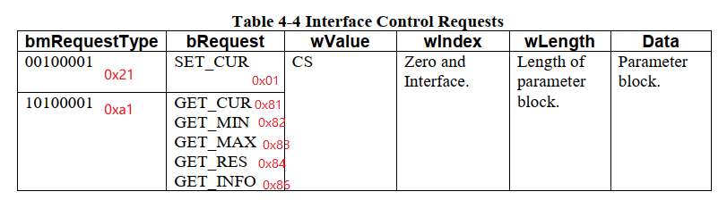
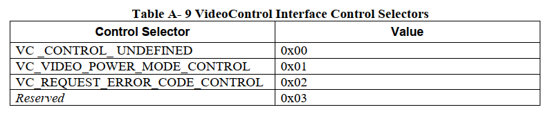
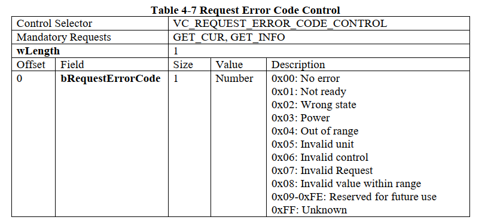
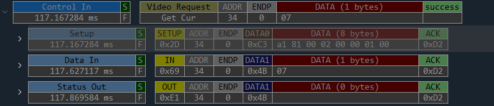
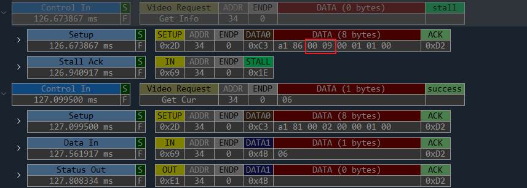
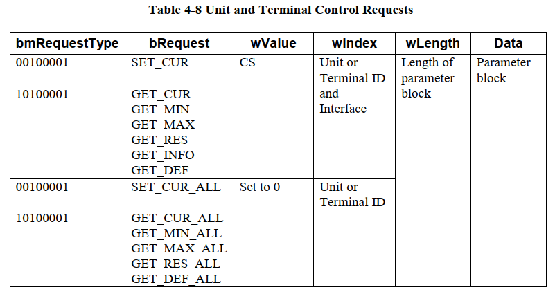

========================
video_control_requests
========================

video_control_requests：

 - Interface Control Request

     - Power Mode Control
     - Request Error Code Control
 - Unit and Terminal Control Requests

     - Camera Terminal Control Requests
     - Selector Unit Control Requests
     - Processing Unit Control Requests
     - Encoding Units
     - Extension Unit Control Requests

Interface Control Request
===========================

The **wValue** field specifies the **Control Selector (CS)** in the high byte, and the low byte must be
set to zero.

**VC Interface Control Selector** 如下图所示：

----------------------
Power Mode Control
----------------------

-----------------------------
Request Error Code Control
-----------------------------

.. figure:: ../_static/request_err_code2.png
    :align: center
    :alt: Images
    :figclass: align-center

使用场景如下：

.. figure:: ../_static/get_ct_info.png
    :align: center
    :alt: Images
    :figclass: align-center

第一次传输Get info 请求失败（STALL），因此接下来获取失败原因 Get_Cur VC_REQUEST_ERROR_CODE_CONTROL

Unit and Terminal Control Requests
====================================

------------------------------------
Camera Terminal Control Requests
------------------------------------

.. figure:: ../_static/ct_control_selectors.png
    :align: center
    :alt: Images
    :figclass: align-center