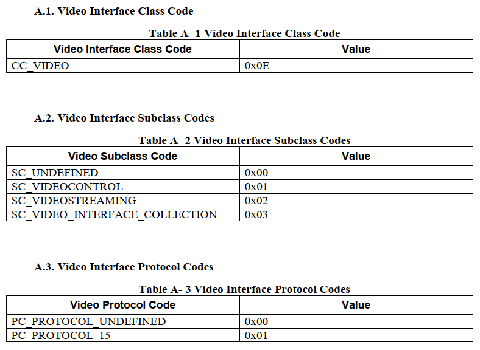

=========================
video stream descriptor
=========================

VS Interface Descriptor
=========================

Video Stream Interface Descriptor:

 - Standard VS Interface Descriptor
 - Class-Specific VS Interface Descriptors

    - Input Header Descriptor / Output Header Descriptor
    - Format Descriptor
    - Frame Descriptor

There is a single Input or Output Header descriptor for each VS interface.

------------------------------------
Standard VS Interface Descriptor
------------------------------------

.. code-block:: c
    :linenos:

    typedef struct
    {
        uint8_t bLength;            //设备描述符的字节数大小，为0x09
        uint8_t bDescriptorType;    //描述符类型编号，为0x04
        uint8_t bInterfaceNumber;
        uint8_t bAlternateSetting;
        uint8_t bNumEndpoints;
        uint8_t bInterfaceClass;    //CC_VIDEO
        uint8_t bInterfaceSubClass; //SC_VIDEOSTREAMING
        uint8_t bInterfaceProtocol; //PC_PROTOCOL_15
        uint8_t iInterface;
    } __attribute__ ((packed))  MUSB_InterfaceDescriptor;

各字段说明如下：

 - bLength : 描述符大小．固定为0x09．
 - bDescriptorType : 接口描述符类型．固定为0x04．
 - bInterfaceNumber: 该接口的编号,接口编号从0开始．
 - bAlternateSetting : 用于为上一个字段选择可供替换的位置．即备用的接口描述符编号．
 - bNumEndpoint : 使用的端点数目．端点0除外．
 - bInterfaceClass : 类型代码，固定为 **CC_VIDEO** ，值为0x0E．
 - bInterfaceSubClass : 子类型代码，固定为 **SC_VIDEOSTREAMING** ，值为0x02．
 - bInterfaceProtocol : 协议代码, **PC_PROTOCOL_15** 为0x01, **PC_PROTOCOL_UNDEFINED** 未定义为0x00．
 - iInterface : 字符串描述符的索引

-----------------------------------------
Class-Specific VS Interface Descriptors
-----------------------------------------

The class-specific VS interface descriptors consist of ``Input Header``, ``Output Header``, ``Format`` and
``Frame`` descriptors.

Class-specific VS Interface Input Header Descriptor
-----------------------------------------------------

The Input Header descriptor is used for VS interfaces that contain an IN endpoint for streaming
video data.

Table 3-14

.. code-block:: c
    :linenos:

    struct uvc_input_header_descriptor
    {
        uint8_t  bLength;
        uint8_t  bDescriptorType;       //视频特定类描述符类型，CS_INTERFACE，值为0x24
        uint8_t  bDescriptorSubType;    //描述符子类型，VS_INPUT_HEADER，值为0x01
        uint8_t  bNumFormats;
        uint16_t wTotalLength;
        uint8_t  bEndpointAddress;
        uint8_t  bmInfo;
        uint8_t  bTerminalLink;
        uint8_t  bStillCaptureMethod;
        uint8_t  bTriggerSupport;
        uint8_t  bTriggerUsage;
        uint8_t  bControlSize;
        uint8_t  bmaControls[];
    } __attribute__((__packed__));

各字段说明如下：

 - bLength:描述符大小， 13+(p*n)
 - bDescriptorType：视频特定类描述符类型， **CS_INTERFACE** ，值为0x24
 - bDescriptorSubtype:描述符子类型， **VS_INPUT_HEADER** ，值为0x01
 - bNumFormats:此接口下的视频有负载格式描述符的数目，p
 - wTotalLength:视频特定类总大小（包括后续相关描述符）
 - bEndpointAddress：用于视频传输的等时/同步传输或者批量传输的端点地址。
 - bmInfo:视频流接口特性信息。D0为1表示支持动态改变视频格式，为0表示不支持；D1-7保留
 - bTerminalLink：连接此端点的输出端点ID.
 - bStillCaptureMethod：静态抓图的支持方法。0表示不支持，1为方法1，2为方法2，3为方法3.
 - bTriggerSupport：是否支持硬件触发。0不支持，1支持。
 - bTriggerUsage：指示主机软件如何响应来自此接口的中断事件。bTriggerSupport为0忽略此字段。0为静态图像抓取，1为通过按钮的按下与释放抓取。
 - bControlSize：bmaControls的大小。
 - bmaControls:每个字节的D0-D3表示支持命名字段何时提交。

.. figure:: ../_static/video_descriptor_types.png
    :align: center
    :alt: Images
    :figclass: align-center

Class-specific VS Interface Output Header Descriptor
------------------------------------------------------

The Output Header descriptor is used for VS interfaces that contain an OUT endpoint for
streaming video data.

.. code-block:: c
    :linenos:

    struct uvc_output_header_descriptor
    {
        uint8_t  bLength;
        uint8_t  bDescriptorType;
        uint8_t  bDescriptorSubType;
        uint8_t  bNumFormats;
        uint16_t wTotalLength;
        uint8_t  bEndpointAddress;
        uint8_t  bTerminalLink;
        uint8_t  bControlSize;
        uint8_t  bmaControls[];
    } __attribute__((__packed__));

Payload Format Descriptors
-------------------------------

***************************************
H.264 Payload Video Format Descriptor
***************************************

TODO: refer to the documentation USB_Video_Payload_H264_1.5.pdf

Table 3-1 H.264 Payload Video Format Descriptor

Video Frame Descriptor
---------------------------

**************************************
H.264 Payload Video Frame Descriptor
**************************************

TODO: refer to the documentation USB_Video_Payload_H264_1.5.pdf

Table 3-2 H.264 Payload Video Frame Descriptor

Still Image Frame Descriptor
-------------------------------

Color Matching Descriptor
-----------------------------

VS Endpoint Descriptors
=======================================

The video data endpoint can be implemented as either an isochronous or bulk endpoint.

 - isochronous
 - bulk

----------------------------------------------------------
Standard VS Isochronous Video Data Endpoint Descriptor
----------------------------------------------------------

.. code-block:: c
    :linenos:

    typedef struct
    {
        uint8_t bLength;            //设备描述符的字节数大小，为0x7
        uint8_t bDescriptorType;    //描述符类型编号，为0x05
        uint8_t bEndpointAddress;
        uint8_t bmAttributes;       //0x05 Isochronous transfer type. Asynchronous synchronization type
        uint16_t wMaxPacketSize;
        uint8_t bInterval;
    } __attribute__ ((packed))   MUSB_EndpointDescriptor;

---------------------------------------------------
Standard VS Bulk Video Data Endpoint Descriptor
---------------------------------------------------

.. code-block:: c
    :linenos:

    typedef struct
    {
        uint8_t bLength;            //设备描述符的字节数大小，为0x7
        uint8_t bDescriptorType;    //描述符类型编号，为0x05
        uint8_t bEndpointAddress;
        uint8_t bmAttributes;       //D1..0: Transfer type (set to 10 = Bulk),All other bits are reserved.
        uint16_t wMaxPacketSize;
        uint8_t bInterval;
    } __attribute__ ((packed))   MUSB_EndpointDescriptor;
