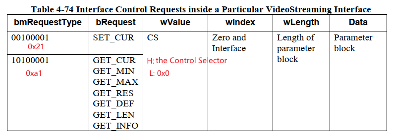
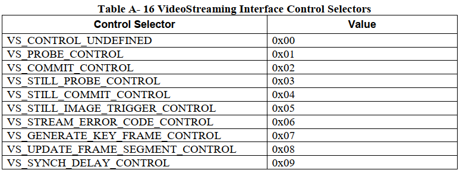
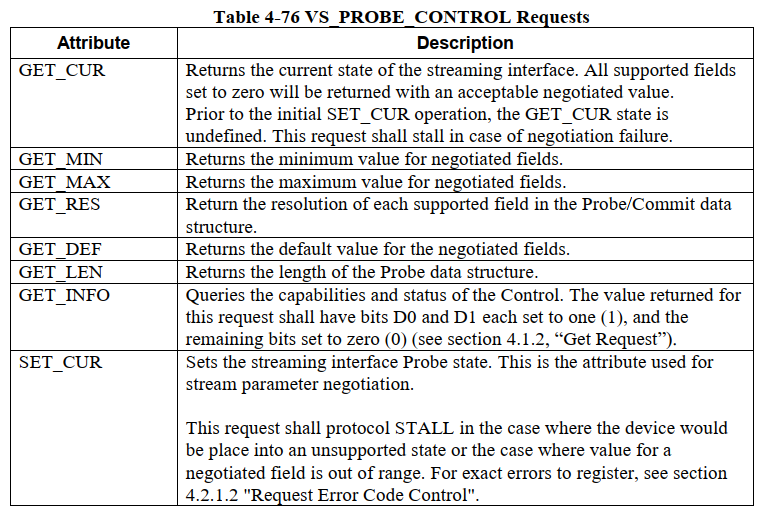
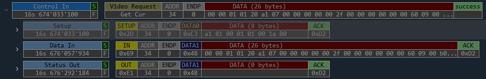
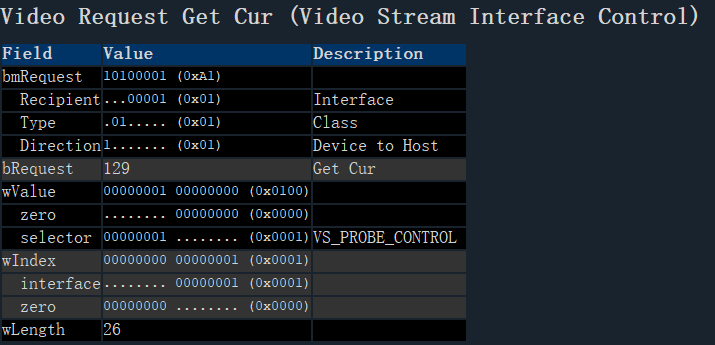

=============================
video_streaming_requests
=============================

video_streaming_requests:

 - Interface Control Requests

     - VS_PROBE_CONTROL
     - VS_COMMIT_CONTROL

Interface Control Requests
===========================

**VS Interface Control Selector** 如下图所示：

---------------------------------
VS_PROBE_CONTROL Requests
---------------------------------

下图是 ``VS_PROBE_CONTROL`` ``GET_CUR`` 一次 **Transfer**

其中， Video Request 如下：

