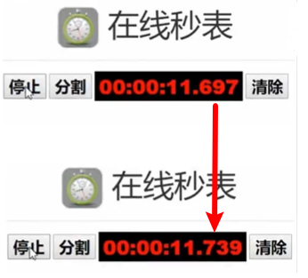

===============
H264编码原理
===============

视频压缩原理
================

编码的目的是为了压缩，各种视频压缩算法都是为了让视频体积变得更小，减少对存储空间和传输带宽的占用。

编码的核心是去冗余信息，通过以下几种冗余来达到压缩视屏的目的：

 - 空间冗余
 - 时间冗余
 - 视觉冗余
 - 编码冗余

----------
空间冗余
----------

图像相邻像素之间有较强的相关性，比如一帧图像划分成多个16x16的块之后，相邻的块很多时候都有比较明显的相似性。

.. figure:: _static/h264_1.png
    :align: center
    :alt: Images
    :figclass: align-center

如上图所示，是视频里面截取出来的一个画面，如图蓝色框框里面的区域它的值都是一样的

---------
时间冗余
---------

视频序列的相邻前后帧图像之间内容相似，比如帧率为25fps的视频中前后两帧图像相差只有40ms，前后两张图像的变化很小，相似性很高。

上面连续两帧除了秒的显示不一样，其他基本都一样。因此在编码时可以只记录前后两帧的差别信息。

----------
视觉冗余
----------

我们的眼睛对某些细节不敏感，对图像中高频信息的敏感度小于低频信息的。可以去除图像中的一些高频信息，人眼看起来跟不去高频信息差别不大（有损压缩）。

---------------------------------
编码冗余（信息熵冗余）
---------------------------------

一幅图像中不同像素出现的概率是不同的。对出现次数比较多的像素，用少的位数来编码。对出现次数比较少的像素，用多的位数来编码，能够减少编码的大小。比如哈夫曼编码。

为什么H264通常是采用yuv420数据做压缩？

- yuv数据量更少，转成yuv，uv相邻很多值都是一样的
- yuv，y可以兼容黑白电视