==============
video basics
==============

视频录制原理
==============

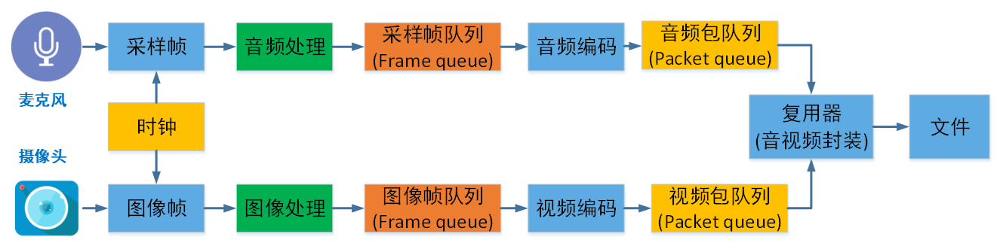

视频播放原理
==============

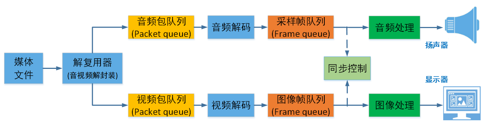

图像基础概念
=============

 - 像素：pixel，像素是图像的基本单位，可以认为像素就是图像中的一个点
 - 分辨率：图像的大小或尺寸，比如1920x1080，横向1920个像素点，竖向1080个像素点
 - 位深：指在记录数字图像的颜色时，计算机实际上是用每个像素需要的 **二进制数值位数** 来表示的。比如红色分量用8bit
 - 帧率：1s传输图片的帧数，比如25fps表示一秒有25张图片
 - 码率：视频文件在单位时间内使用的数据流量。比如1Mbps
 - Stride：指在内存中每行像素所占的空间。为了实现内存对齐每行像素在内存中所占的空间并不一定是图像的宽度。638x480

--------
分辨率
--------

有些网站的分辨率显示是720i和1080i，这个i又指的是什么？同样都是1080，1080i 和 1080p 哪个会更清晰？

i 和 p 指扫描方式，i表示隔行扫描(Interlaced)，p则表示逐行扫描(Progressive)，以1080 的视频为例：

 - 1080i
 - 1080p

.. note::
    常说的720，1080 指的是垂直像素数，分辨率除了垂直像素，还需要考虑到水平像素。

------
码率
------

视频文件在单位时间内使用的数据流量。比如1Mbps

大多数情况下，码率越高，分辨率越高，视频越清晰。

分辨率-码率 推荐表

图像表示
=========

------------------
图像表示 - RGB格式
------------------

RGB指的是R(red)红色、G（green）绿色、B（blue）蓝色，三种颜色。
目前来说，所有的颜色都可以用这三种颜色配出来,RGB各有256级亮度，用数字表示为从0、1、2…直到255,最多可以表示256×256×256=16777216种色彩。

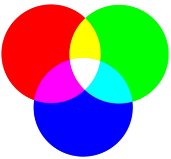

对于一幅图像，一般使用整数表示方法来进行描述，

 - RGB_888(3 bytes)
 - RGB_565(2 bytes)

比如计算一张的RGB_888图像的大小，可采用如下方式：

1280×720 * 3 = 2.637 MB，4分钟就达到了2.637x25x60x4=15G的容量。

假如是一部90分钟的电影，每秒25帧，则一部电影为

2.637MB*90分钟*60秒*25FPS= 347.651GB

------------------
图像表示 - YUV格式
------------------

与我们熟知RGB类似，YUV也是一种颜色编码方法，它是将 **亮度参量**（Y：Luminance或Luma）和 **色度参量** （UV：Chrominance或Chroma）分开
进行表示的像素编码格式。

用途：主要用于视频信号的压缩、传输和存储，和向后相容老式黑白电视。

其中“Y”表示明亮度（Luminance或Luma）， **也称灰阶值**；

“U”和“V”表示的则是色度（Chrominance或Chroma）

作用是描述影像色彩及饱和度，用于指定像素的颜色。

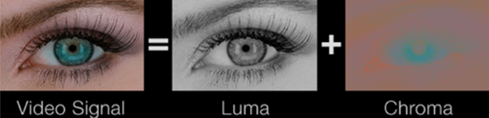

采样格式
----------

YUV 采用A:B:C表示法来描述Y,U,V采样频率比例，下图中黑点表示采样 **像素点Y分量**，空心圆表示采样像素点的 **UV分量**。

主要分为：

 - YUV 4:4:4
 - YUV 4:2:2
 - YUV 4:2:0

这几种常用的类型。

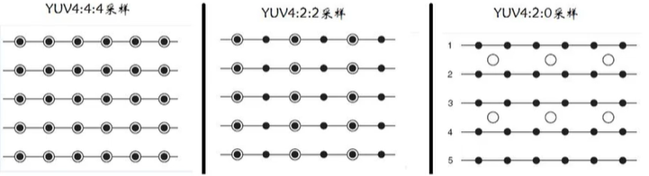

    YUV 采样方式

采样方式如下：

 - YUV 444：一个Y分量对应着一个U分量和一个V分量
 - YUV 422：每两个Y分量共用一个U分量和一个V分量
 - YUV 420：每四个Y分量共用一个U分量和一个V分量

存储排列格式
---------------

YUV格式有两大类：

 - planar，平面格式，这种分离的格式比较方便视频编码
 - packed，打包格式，打包格式在网络摄像头中较为常见

对于 **planar** 的YUV格式，先连续存储所有像素点的Y，紧接着存储所有像素点的U，随后是所有像素点的V。

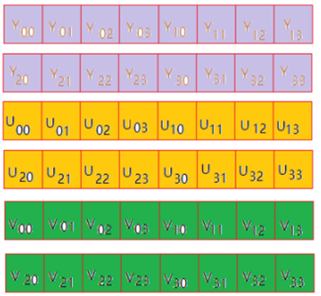

    YUV444 planar格式 (I444)

对于 **packed** 的YUV格式，每个像素点的Y,U,V是连续交叉存储的。

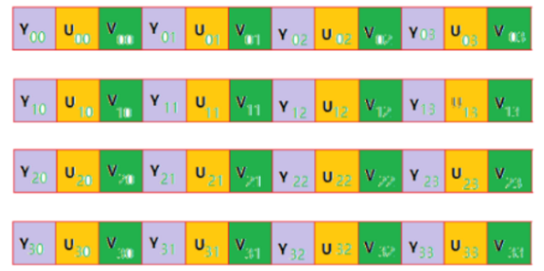

    YUV444 packet格式

*******************
YUV 4:2:2 数据存储
*******************

YUV 4:2:2 数据存储格式，每个像素点 16 bits

 - packed

   - YUYV
   - YVYU
   - UYVY
   - VYUY

 - planar

   - I422(YUV422P)

 - Semi-planar

   - NV16
   - NV61

YUYV(V422/YUV2/YUNV)
*************************

4:2:2 Formats, 16 Bits per Pixel

``YUYV`` 通常也称作 ``V422``、 ``YUY2``、 ``YUNV``

YUY2 是 ``Packed`` 打包格式，其中两个像素共用一组 UV 分量，内存中按照 Y U Y V 的顺序排列，如下图所示：

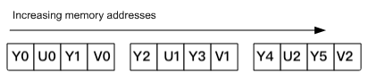

UYVY(Y422/UYNV)
*************************

4:2:2 Formats, 16 Bits per Pixel

``UYVY`` 通常也称作 ``Y422``、 ``UYNV``

``UYVY`` 与 ``YUYV`` 类似，只是亮度（Y）分量与色度（UV）分量排列顺序颠倒，如下图所示：

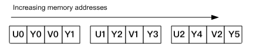

I422
*************************

4:2:2 Formats, 16 Bits per Pixel, 3 Planars

``I422`` 属于 ``YUV422P`` 格式。三个平面，分别存储 Y U V 分量。每两个 Y 分量共享一组 UV 分量。
U、V 平面的 strides, width 是 Y 平面的一半，但 height 与 Y 平面一致，因此一个像素 16 bits，内存排列如下图所示：

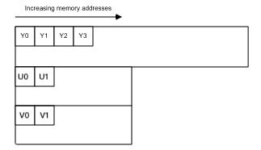

*******************
YUV 4:2:0 数据存储
*******************

YUV 4:2:0 数据存储格式

 - YUV420P

   - I420(IYUV/YU12)：YYYYYYYY UU VV， **I420** 是音视频开发中常用的一种格式
   - YV12：YYYYYYYY VV UU

 - YUV420sp

   - NV12：YYYYYYYY UV UV
   - NV21：YYYYYYYY VU VU

I420(YUV420P)
**************

YUV 4:2:0 数据存储 - I420(YUV420P)

 - 对应 Ffmpeg像素表示 AV_PIX_FMT_YUV420P
 - 该类型为planar格式
 - 1个像素点大小： 1 + 1/4 + 1/4 = 1.5字节(每四个Y分量共用一个U分量和一个V分量)

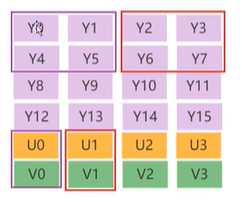

    I420(YUV420P)格式

NV12(YUV420SP)
**************

对应 Ffmpeg像素表示 AV_PIX_FMT_NV12

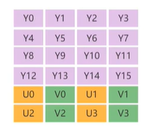

    NV12(YUV420SP)格式

------------------------------------
分离 I420 像素数据中的Y、U、V分量
------------------------------------

.. code-block:: c

    int simplest_yuv420_split(char *url, int w, int h,int num)
    {
        FILE *fp=fopen(url,"rb+");
        FILE *fp1=fopen("output_420_y.y","wb+");
        FILE *fp2=fopen("output_420_u.y","wb+");
        FILE *fp3=fopen("output_420_v.y","wb+");

        unsigned char *pic=(unsigned char *)malloc(w*h*3/2);

        for(int i=0;i<num;i++) {

            fread(pic,1,w*h*3/2,fp);
            //Y
            fwrite(pic,1,w*h,fp1);
            //U
            fwrite(pic+w*h,1,w*h/4,fp2);
            //V
            fwrite(pic+w*h*5/4,1,w*h/4,fp3);
        }

        free(pic);
        fclose(fp);
        fclose(fp1);
        fclose(fp2);
        fclose(fp3);

        return 0;
    }

如果视频帧的宽和高分别为w和h，那么一帧YUV420P像素数据一共占用w*h*3/2 Byte的数据。其中前w*h Byte存储Y，接着的w*h*1/4 Byte存储U，最后w*h*1/4 Byte存储V。

RGB和YUV的转换
================

通常情况下RGB和YUV直接的相互转换都是调用接口实现，比如 ffmpeg 的 swscale 或者 libyuv 等库。

.. code-block:: text

    R = 1.164(Y - 16) + 1.596(V - 128)
    G = 1.164(Y - 16) - 0.813(V - 128) - 0.391(U - 128)
    B = 1.164(Y - 16) + 2.018(U - 128)

----------------------
为什么解码出错显示绿屏
----------------------

YUV->H264->YUV

申请内存缓存数据，memset为0，因为解码失败，因此YUV分量都为0，代入上面公式：

.. code-block:: text

    R=0
    G=135.488
    B=0

此时只有G分量有值，所以为绿色。

视频压缩原理
================

编码的目的是为了压缩，各种视频压缩算法都是为了让视频体积变得更小，减少对存储空间和传输带宽的占用。

编码的核心是去冗余信息，通过以下几种冗余来达到压缩视屏的目的：

 - 空间冗余
 - 时间冗余
 - 视觉冗余
 - 编码冗余

空间冗余

图像相邻像素之间有较强的相关性，比如一帧图像划分成多个16x16的块之后，相邻的块很多时候都有比较明显的相似性。

时间冗余

为什么H264通常是采用yuv420数据做压缩？

- yuv数据量更少，转成yuv，uv相邻很多值都是一样的
- yuv，y可以兼容黑白电视

ffmpeg
========

ffmpeg实现mp4文件转h264文件

.. code-block:: text

    ffmpeg -i sample_640x360_1mb.mp4 -c h264 test.h264