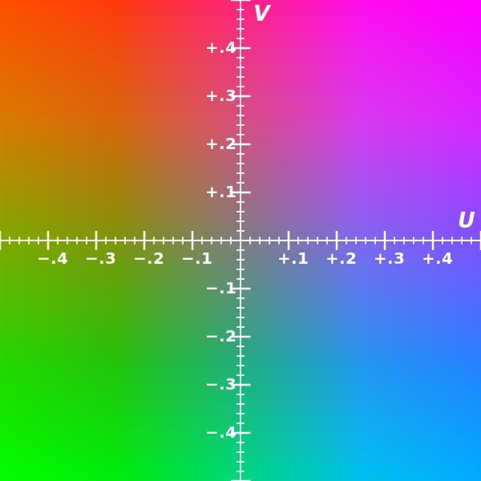
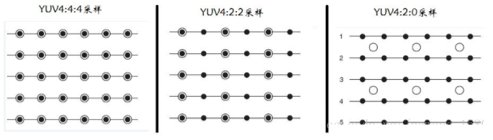
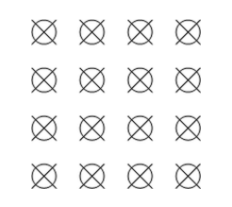
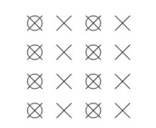
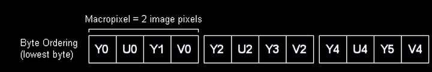
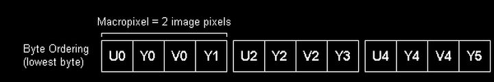

=====
YUV
=====

https://blog.csdn.net/GGY1102/article/details/121733746

摘录自以下链接：
https://www.usbzh.com/article/detail-214.html

概述
=========

(YCrCb)是指将亮度参量Y和色度参量U/V分开表示的像素格式，主要用于优化彩色视频信号的传输。
 - Y 表示明亮度（Luminance,Luma或brightness），也就是灰阶值
 - U 和 V 表示的则是色度（Chrominance或Chroma），作用是描述影像色彩及饱和度，用于指定像素的颜色。

下面是亮度图（亮度从低到高）

YUV_UV 图

YUV像素格式来源于RGB像素格式，通过公式运算，YUV 三分量可以还原出 RGB，YUV 转 RGB 的公式如下：

.. code-block:: text

    R = Y + 1.403V
    G = Y - 0.344U - 0.714V
    B = Y + 1.770U

一般，将 RGB 和 YUV 的范围均限制在 [0, 255] 间，则有如下转换公式：

.. code-block:: text

   R = Y + 1.403(V - 128）
   G = Y - 0.344(U - 128) - 0.714(V - 128)
   B = Y + 1.770(U - 128)

鉴于 RGB 格式已经见得见多，本文主要总结 YUV 常见的几种像素格式。

YUV 相比于 RGB 格式最大的好处是可以做到在保持图像质量降低不明显的前提下，减小文件大小。YUV 格式之所以能够做到，是因为进行了采样操作。

YUV 采样方式
=============

YUV 码流的存储格式与其采样方式密切相关，主流的采样方式有三种：YUV 4:4:4(YUV444)，YUV 4:2:2(YUV422)，YUV 4:2:0(YUV420)。

若以以黑点表示采样该像素点的 Y 分量，以空心圆圈表示采用该像素点的 UV 分量，则这三种采样方式如下：

即：

YUV 4:4:4 采样，每一个 Y 对应一组 UV 分量。
YUV 4:2:2 采样，每两个 Y 共用一组 UV 分量。
YUV 4:2:0 采样，每四个 Y 共用一组 UV 分量。

----------------
YUV 4:4:4 采样
----------------

YUV 4:4:4 采样，意味着 Y、U、V 三个分量的采样比例相同，因此在生成的图像里，每个像素的三个分量信息完整，都是 8 bit，也就是一个字节。

其中，Y 分量用叉表示，UV 分量用圆圈表示。

举个例子 ：

.. code-block:: text

    假如图像像素为：[Y0 U0 V0]、[Y1 U1 V1]、[Y2 U2 V2]、[Y3 U3 V3]
    那么采样的码流为：Y0 U0 V0 Y1 U1 V1 Y2 U2 V2 Y3 U3 V3
    最后映射出的像素点依旧为 [Y0 U0 V0]、[Y1 U1 V1]、[Y2 U2 V2]、[Y3 U3 V3]

可以看到这种采样方式的图像和 RGB 颜色模型的图像大小是一样，并没有达到节省带宽的目的，当将 RGB 图像转换为 YUV 图像时，也是先转换为 YUV 4:4:4 采样的图像。

----------------
YUV 4:2:2 采样
----------------

YUV 4:2:2 采样，意味着 UV 分量是 Y 分量采样的一半，Y 分量和 UV 分量按照 2 : 1 的比例采样。如果水平方向有 10 个像素点，那么采样了 10 个 Y 分量，而只采样了 5 个 UV 分量。

如下图所示：

其中，Y 分量用叉表示，UV 分量用圆圈表示。

举个例子 ：

.. code-block:: text

    假如图像像素为：[Y0 U0 V0]、[Y1 U1 V1]、[Y2 U2 V2]、[Y3 U3 V3]
    那么采样的码流为：Y0 U0 Y1 V1 Y2 U2 Y3 V3
    其中，每采样过一个像素点，都会采样其 Y 分量，而 U、V 分量就会间隔一个采集一个。
    最后映射出的像素点为 [Y0 U0 V1]、[Y1 U0 V1]、[Y2 U2 V3]、[Y3 U2 V3]

采样的码流映射为像素点，还是要满足每个像素点有 Y、U、V 三个分量。但是可以看到，第一和第二像素点公用了 U0、V1 分量，第三和第四个像素点公用了 U2、V3 分量，这样就节省了图像空间。

一张 1280 * 720 大小的图片，在 YUV 4:2:2 采样时的大小为：

.. code-block:: text

    total = w * h + w * h * 2 / 2
    （1280 * 720  + 1280 * 720 * 0.5 * 2） / 1024 / 1024 = 1.76 MB 。

可以看到 YUV 4:2:2 采样的图像比 RGB 模型图像节省了三分之一的存储空间，在传输时占用的带宽也会随之减少。

YUV 存储格式
============

说完了采样，接下来就是如何把采样的数据存储起来。

YUV 的存储格式，有两种：
 - planar 平面格式:指先连续存储所有像素点的 Y 分量，然后存储 U 分量，最后是 V 分量。
 - packed 打包模式:指每个像素点的 Y、U、V 分量是连续交替存储的。

根据采样方式和存储格式的不同，就有了多种 YUV 格式。这些格式主要是用于 YUV 4:2:2 和 YUV 4:2:0 采样。

---------------------------------
YUV422：YUYV、YVYU、UYVY、VYUY
---------------------------------

YUV 4:2:2 采样规定了 Y 和 UV 分量按照 2: 1 的比例采样，两个 Y 分量公用一组 UV 分量。

这四种格式每一种又可以分为 2 类（packed和planar），以 YUYV 为例，一个 6*4 的图像的存储方式如下：

.. code-block:: text

    Y Y Y Y Y Y
    Y Y Y Y Y Y
    Y Y Y Y Y Y
    Y Y Y Y Y Y
    U U U U U U                        Y U Y V Y U Y V Y U Y V
    U U U U U U                        Y U Y V Y U Y V Y U Y V
    V V V V V V                        Y U Y V Y U Y V Y U Y V
    V V V V V V                        Y U Y V Y U Y V Y U Y V
    - Planar -                          - Packed -

YUYV 格式
-----------

YUYV 格式是采用打包格式进行存储的，指每个像素点都采用 Y 分量，但是每隔一个像素采样它的 UV 分量，排列顺序如下：

.. code-block:: text

    Y0 UO Y1 V0 Y2 U2 Y3 V2

Y0 和 Y1 公用 U0 V0 分量，Y2 和 Y3 公用 U2 V2 分量….

UYVY 格式
-----------

UYVY 格式也是采用打包格式进行存储，它的顺序和 YUYV 相反，先采用 U 分量再采样 Y 分量，排列顺序如下：

.. code-block:: text

    U0 Y0 V0 Y1 U2 Y2 V2 Y3

Y0 和 Y1 公用 U0 V0 分量，Y2 和 Y3 公用 U2 V2 分量….

根据 UV 和 Y 的顺序还有其他格式，比如，YVYU 格式，VYUY 格式等等，原理大致一样了。

YUV 422P 格式
--------------

YUV 422P 格式，又叫做 I422，采用的是平面格式进行存储，先存储所有的 Y 分量，再存储所有的 U 分量，再存储所有的 V 分量。