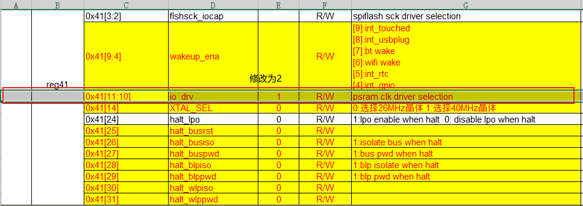

==================
yuv 调试记录
==================

测试case
==========

测试case如下：

 - yuv mode下，数据基址为psram，完成后显示在屏幕上。（480p）
 - yuv mode下，partial 功能的测试。
 - yuv mode的高分辨率测试。（600p或720p）

测试命令
========

.. code-block:: text

    media dvp open yuv
    media lcd open

时钟配置
==========

1. 先看video模块的主时钟配置，即system里面的配置：

 - SYSTEM 0x8[30] ``clk_sel_jpeg``，选择video模块的时钟源320M/480M，一般设为1选择480M
 - SYSTEM 0x8[29:26] ``clk_div_jpeg``，video模块的分频系数，假设设为5，则video模块的时钟为80M
 - 时钟打开，需要打开这两个Bit ``jpeg_clk_en``， ``h264_clk_en``

.. note::
    关于 yuv_clk_en 这个bit，打不开开无所谓，数字没有对其做相关操作

2. 各子模块的时钟

假设video模块的主时钟为80M，那么

 - 对于H264，这80M会直接给到H264，H264模块的时钟为80M
 - 对于YUV/JPEG模块，会对80M进行2分频，即80M/2=40M

3. 关于MCLK_DIV

.. note::
    MCLK_DIV 只会影响sensor的MCLK，而不会影响yuv,jpeg,h264等模块本身的工作时钟。

4. yuv/jpeg 工作时钟 与 ``MCLK`` ``PCLK`` 之间的关系

 - MLCK，PCLK之间的关系是由摄像头本身的寄存器配置决定的，比如GC0328C PCLK=MLCK，GC2145 PCLK=2MCLK。
 - 如果不配置 ``AUXS`` 时钟，MCLK时钟则为 YUV/JPEG 模块分得，通过配置 MCLK_DIV
 - YUV/JPEG 工作时钟需要满足 大于等于 2倍的PCLK，即 JPEG_CLK=YUV_CLK ≥ 2PCLK

YUV 中断
===========

YUV 中断

 - sensor resolution error int：分辨率错误中断，sensor的数据错误
 - TODO

YUV partial 功能
=====================

YUV partial 功能的使用：

 - sensor 设置 640x480
 - yuv 分辨率设置 640x480
 - yuv partial 功能打开，partial 分辨率 设置为 480x272，此时yuv会自动往PSRAM写480x272的数据
 - display 分辨率设置为 480x272

.. code-block:: c

    yuv_mode_config.x_pixel = 640 / 8;
    yuv_mode_config.y_pixel = 480 / 8;

    yuv_buf_partial_offset_config_t offset_config = {0};
    offset_config.x_partial_offset_l = 1;
    offset_config.x_partial_offset_r = 480;
    offset_config.y_partial_offset_l = 1;
    offset_config.y_partial_offset_r = 272;
    bk_yuv_buf_init_partial_display(&offset_config);

YUV 720P 25FPS
===================

1. 如何看当前摄像头的帧率

我们知道VSYNC是发一帧的信号，所以VSYNC的频率就是当前帧率。

如上图所示，测得当前帧率为25

2. 如何让摄像头工作在 720P 30fps

首先摄像头本身要支持720P，以gc2145为例。

.. figure:: ../_static/change_ppi.png
    :align: center
    :alt: Images
    :figclass: align-center

如图所示，在 media_cli.c 中直接修改即可。

.. figure:: ../_static/change_fps.png
    :align: center
    :alt: Images
    :figclass: align-center

帧率在如图所示位置修改。

3. PSRAM的时钟配置

高分辨率下，对PSRAM的读写速度要求提高，需要将PSRAM的时钟从80M提到160M。

0x9[5]	cksel_psram	0	R/W	0:clk_320M      1:clk_480M

0x9[4]	ckdiv_psram	0	R/W	Frequency division : F/(1+N), N is the data of the reg value

.. note::
    需要注意的是硬件内部会自动对PSRAM时钟二分频。假设PSRAM时钟源为320M，分频系数为0，那么实际到PSRAM的时钟为160M。

.. note::
    当PSRAM时钟修改为160M时，对应的IO口负载修改为2，对应PMU寄存器如下图所示。

常见问题
==========

1. camera i2c 通信失败

 - 检查供电，相关跳线帽是否正常
 - 检查 MCLK，这是我们芯片供给camera的时钟，camera需要此时钟才能工作

关于如何输出MCLK，以及输出MCLK的频率，可以参考 **时钟配置** 章节。

2. 显示问题

.. note::
    需要注意的是，在yuv mode下，我们测出了yuv finish中断出现异常。绕过这个bug，需要将vsync下降沿中断当做yuv finish中断，并在每一帧中断里重新开关yuv mode